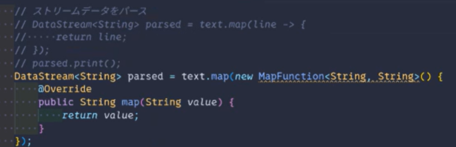

いくつかわからない点があって困っているので質問させてください！

# 現状

一言でいうと、
「Client.javaでのaddSink()でWebSocketにデータを送信する方法がよくわからない。」

`.process(new StockTimeWindowFunction())`の時点で、JSONとしてパースできるStringデータとして整形している。
その後の`.addSink()`でRichSinkFunctionを拡張したStockRichSinkFunctionを実装しようとしているが、Web側との接続がうまくいかない。

# 質問

1. RichSinkFunctionを上野さんが使っていたので、使おうとしたが、現在のFlinkでは非推奨になっているとのことで、このまま使ってもいいのか、ほかにおすすめのSinkFunctionがあるか。
2. JavaScript側ではlocalhost:3000のサーバーに接続するが、Client.javaでサーバーを起動しておかないといけないと思うが、それはどのタイミングで起動するのがよいのか。現在は、`main()`メソッドのはじめに起動しているつもりなのだが、その状態で、Javascript側で接続しようとしてもうまくいかない。
3. WebSocketにデータを送信するための具体的な実装方法について、何か参考になるコードやドキュメントがあれば教えてください。
4. addSink()とprint()を同時に行うことは可能か。もし可能であれば、どのように記述すればよいか？

# 補足

- Serverは現在Server_Extended.java(先日送っていただいたコードを元に動作確認済み)を使用。
- 実行(▷)ボタンから-time,-count選択可能。
  - Timeウィンドウ側のみJSON形式で出力される（はず）。以下、例。
      ```json
      { "WindowRecords": [{"stock": "株F", "open": 257.71, "high": 278.06, "low": 238.07, "close": 277.08, "timestamp": 16:43:54.68},{"stock": "株U", "open": 251.02, "high": 265.39, "low": 185.46, "close": 192.27, "timestamp": 16:43:55.18},{"stock": "株E", "open": 66.9, "high": 84.61, "low": 60.77, "close": 62.5, "timestamp": 16:43:55.68}],"AggregateRecords": [{"stock": "株F", "Ave": 277.08, "Max": 277.08, "Min": 277.08, "Std": 0.00},{"stock": "株E", "Ave": 62.50, "Max": 62.50, "Min": 62.50, "Std": 0.00},{"stock": "株U", "Ave": 192.27, "Max": 192.27, "Min": 192.27, "Std": 0.00}]}
      ```
  - Countウィンドウ側は、ターミナルで見やすいような集計結果の表示方法をしている。