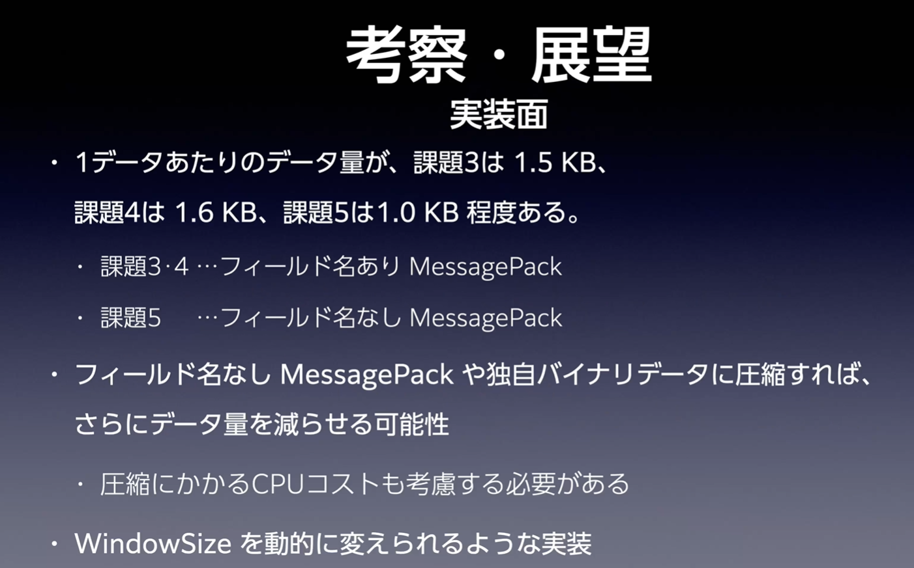
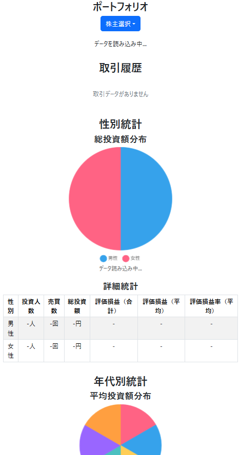
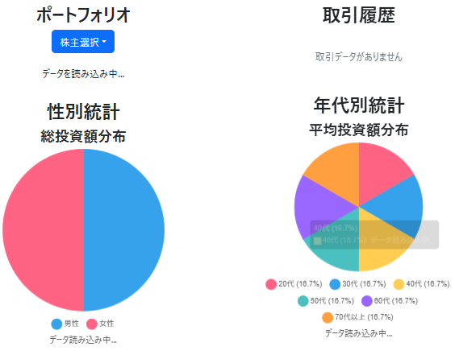
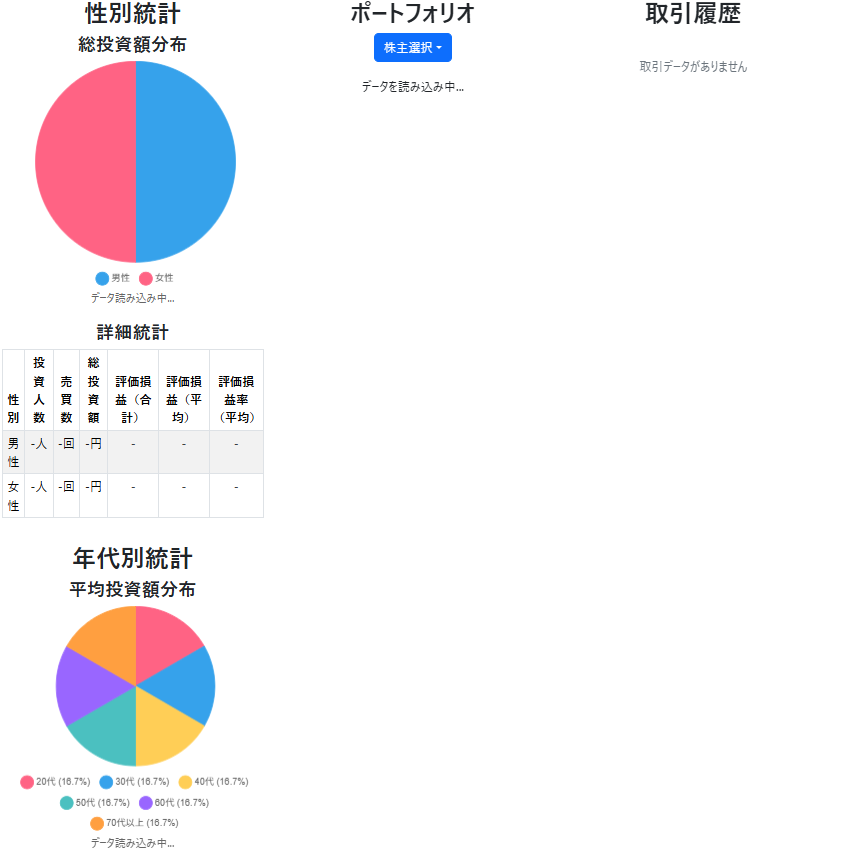

<!-- 〆切: 8月6日17時
計算はすべてJavaで行った。
react側から株主を選択した情報をJavaに送り、必要な分だけのポートフォリオ情報を送ることができるようになり、通信が重くならないよう工夫した。
ApacheFlinkを使わず、Javaで実装
概要

各データセットの概要



message pack
今回はサーバーも自分で用意したが、本来は何かしら用意されてるサーバーから配信されている情報をもとに処理をする中間サーバーを用意する事が多い。今回作った形をより現実に近づけるとしたら、あくまでも株取引データと株価データは,関連性はひつようだが別々に送られてきて、しかるべきなので、本来のタイムスタンプ順の並び替え語の処理という部分もきちんと実装したかった。 -->
<!-- レポート タイトル部分 -->
<div style='text-align:center'>
<div style='font-size:1.5rem'>主専攻実験 K-4-2025 最終レポート</div>
<div style='font-size:1rem'>202310970 五十嵐尊人</div>
<br />
<br />
</div>
<!--  -->

# 目次

- [目次](#目次)
- [0. 要旨](#0-要旨)
- [1. はじめに](#1-はじめに)
  - [1.1 背景と動機](#11-背景と動機)
  - [1.2 目的と課題設定](#12-目的と課題設定)
  - [1.3 本レポートの構成](#13-本レポートの構成)
- [2. システム概要](#2-システム概要)
  - [2.1 システムの全体像](#21-システムの全体像)
  - [2.2 主要機能](#22-主要機能)
    - [リアルタイム取引システム](#リアルタイム取引システム)
    - [ポートフォリオ管理](#ポートフォリオ管理)
    - [統計分析・可視化](#統計分析可視化)
    - [レスポンシブUI](#レスポンシブui)
- [3. システム設計](#3-システム設計)
  - [3.1 アーキテクチャ設計](#31-アーキテクチャ設計)
    - [3.1.1 マイクロサービス構成](#311-マイクロサービス構成)
    - [3.1.2 データフロー設計](#312-データフロー設計)
    - [3.1.3 標準課題からの変更点と改善理由](#313-標準課題からの変更点と改善理由)
  - [3.2 データモデル設計](#32-データモデル設計)
    - [3.2.1 銘柄情報・株主情報](#321-銘柄情報株主情報)
    - [3.2.2 取引データ構造](#322-取引データ構造)
    - [3.2.3 ポートフォリオ管理構造](#323-ポートフォリオ管理構造)
  - [3.3 通信プロトコル設計](#33-通信プロトコル設計)
    - [3.3.1 Socket通信（サービス間）](#331-socket通信サービス間)
    - [3.3.2 WebSocket通信（クライアント-サーバー間）](#332-websocket通信クライアント-サーバー間)
- [4. 実装詳細](#4-実装詳細)
  - [4.1 バックエンド実装](#41-バックエンド実装)
    - [4.1.1 Transaction.java - 取引生成エンジン](#411-transactionjava---取引生成エンジン)
      - [取引生成ロジック](#取引生成ロジック)
      - [売買数量決定ロジック](#売買数量決定ロジック)
    - [4.1.2 PriceManager.java - 株価管理システム](#412-pricemanagerjava---株価管理システム)
      - [価格変動ロジック](#価格変動ロジック)
      - [取引処理と価格保証](#取引処理と価格保証)
      - [初期株価の設定](#初期株価の設定)
    - [4.1.3 StockProcessor.java - 分析処理エンジン](#413-stockprocessorjava---分析処理エンジン)
      - [ポートフォリオ管理](#ポートフォリオ管理-1)
      - [スライディングウィンドウ処理](#スライディングウィンドウ処理)
      - [統計計算 - 性別統計](#統計計算---性別統計)
      - [地域別ポートフォリオ分析](#地域別ポートフォリオ分析)
    - [4.1.4 WebSocketサーバー実装](#414-websocketサーバー実装)
  - [4.2 フロントエンド実装](#42-フロントエンド実装)
    - [4.2.1 React + TypeScript構成](#421-react--typescript構成)
    - [4.2.2 リアルタイムデータ処理](#422-リアルタイムデータ処理)
    - [4.2.3 Chart.jsによるデータ可視化](#423-chartjsによるデータ可視化)
    - [4.2.4 レスポンシブUI実装](#424-レスポンシブui実装)
      - [ブレークポイント設計](#ブレークポイント設計)
      - [3段階レイアウト切り替え](#3段階レイアウト切り替え)
- [5. 技術的工夫と課題解決](#5-技術的工夫と課題解決)
  - [5.1 データ整合性の保証](#51-データ整合性の保証)
    - [5.1.1 価格保証システム](#511-価格保証システム)
    - [5.1.2 並行処理対応](#512-並行処理対応)
    - [5.1.3 空売り防止機能(未完成)](#513-空売り防止機能未完成)
  - [5.2 取引に応じた動的価格変動](#52-取引に応じた動的価格変動)
    - [5.2.1 価格変動アルゴリズム](#521-価格変動アルゴリズム)
  - [5.3 現実的な取引生成ロジック](#53-現実的な取引生成ロジック)
    - [5.3.1 保有株数ベースの売買判断](#531-保有株数ベースの売買判断)
- [7. 開発過程で直面した課題](#7-開発過程で直面した課題)
  - [7.1 技術的課題](#71-技術的課題)
    - [7.1.1 データ同期問題](#711-データ同期問題)
    - [7.1.2 マイクロサービス間通信の複雑性](#712-マイクロサービス間通信の複雑性)
    - [7.1.3 リアルタイム性能の確保](#713-リアルタイム性能の確保)
  - [7.2 課題への対処法](#72-課題への対処法)
    - [7.2.1 実装した解決策](#721-実装した解決策)
  - [7.3 未解決の課題](#73-未解決の課題)
- [8. 評価と検証・考察](#8-評価と検証考察)
  - [8.1 機能評価](#81-機能評価)
    - [8.1.1 実装した機能の動作確認](#811-実装した機能の動作確認)
    - [8.1.2 パフォーマンス測定](#812-パフォーマンス測定)
  - [8.3 システムの限界と制約](#83-システムの限界と制約)
  - [8.4 リアルタイムデータ処理技術の比較](#84-リアルタイムデータ処理技術の比較)
- [10. 今後の展望](#10-今後の展望)
  - [10.1 短期的改善案](#101-短期的改善案)
    - [10.1.1 データ同期問題の根本解決](#1011-データ同期問題の根本解決)
    - [10.1.2 投資家行動の高度化](#1012-投資家行動の高度化)
  - [10.2 長期的発展構想](#102-長期的発展構想)
    - [10.2.1 機能拡張（信用取引、配当システム等）](#1021-機能拡張信用取引配当システム等)
- [11. まとめ](#11-まとめ)
  - [11.1 達成した成果](#111-達成した成果)
  - [11.2 技術的な学び](#112-技術的な学び)
  - [11.3 今後の課題](#113-今後の課題)
- [12. 参考文献・使用技術](#12-参考文献使用技術)
- [付録](#付録)
  - [A. ソースコード構成](#a-ソースコード構成)
    - [主要ファイル機能説明](#主要ファイル機能説明)
      - [バックエンド](#バックエンド)
      - [フロントエンド](#フロントエンド)
  - [B. 開発環境・ツール](#b-開発環境ツール)
    - [開発環境](#開発環境)
    - [開発ツール](#開発ツール)
    - [ライブラリ・フレームワーク（主要なもの）](#ライブラリフレームワーク主要なもの)
  - [C. 動作確認手順](#c-動作確認手順)
    - [前提条件](#前提条件)
    - [1. プロジェクトの取得](#1-プロジェクトの取得)
    - [2. バックエンドの起動](#2-バックエンドの起動)
    - [3. フロントエンドの起動](#3-フロントエンドの起動)
    - [4. システムへのアクセス](#4-システムへのアクセス)
    - [5. システムの操作方法](#5-システムの操作方法)
      - [ポートフォリオ閲覧](#ポートフォリオ閲覧)
      - [統計情報の確認](#統計情報の確認)
      - [レスポンシブ表示の確認](#レスポンシブ表示の確認)
  - [D. 発表スライド](#d-発表スライド)

# 0. 要旨

本プロジェクトでは、リアルタイムで株式取引を模擬し、投資家のポートフォリオ分析を行うWebアプリケーションを開発しました。システムは取引データの生成、株価の動的変動、ポートフォリオの管理、および統計分析機能を備えています。

バックエンドはJavaによるマイクロサービスアーキテクチャを採用し、取引生成、価格管理、データ分析の3つの独立したサービスで構成されています。フロントエンドはReact+TypeScriptで実装し、WebSocketによるリアルタイム通信を実現しました。

特に動的な株価変動、価格保証システムの実装、地域別ポートフォリオ分析、性別・年代別統計などの機能を通じて、実際の株式市場に近い挙動を実現することができました。

# 1. はじめに

## 1.1 背景と動機

本レポートでは、主専攻実験の一環として、株式分析システムの実装を行いました。この課題は標準課題であり、元々株取引に興味があったことと、課題1~5で学んだ内容を活かして実装を行うことができると考えたため、取り組むことにしました。また、この課題は実装の拡張性を持ち、将来的な機能追加や改善が容易である点も魅力でした。

## 1.2 目的と課題設定

本プロジェクトの主な目的は以下の通りです：

1. **リアルタイムデータ処理技術の習得**：WebSocketやスライディングウィンドウなどを用いたリアルタイムデータ処理の実践
2. **マイクロサービスアーキテクチャの実装**：複数の独立したサービス間の連携による分散システム設計
3. **動的なデータ可視化の実現**：React+Chart.jsを用いた直感的なデータ表現
4. **現実的な市場シミュレーション**：実際の株式市場に近い挙動を再現する仕組みの構築

課題設定としては、標準課題をベースとしながらも、特に以下の拡張・改善に焦点を当てました：

- 取引に応じた動的株価変動システムの構築
- 株取引、ポートフォリオの正しい株価参照の保証
- レスポンシブUIによるマルチデバイス対応

## 1.3 本レポートの構成

本レポートは以下の構成で、システムの設計から実装、評価まで詳細に説明します：

- 第2章では、システムの全体像と主要機能について概説します
- 第3章では、アーキテクチャとデータモデルの設計について詳細に説明します
- 第4章では、バックエンドとフロントエンドの具体的な実装について解説します
- 第5章では、技術的な工夫点と課題解決のアプローチについて述べます
- 第6章から11章では、UIの設計、開発課題、評価、関連技術、今後の展望とまとめを記します

# 2. システム概要

## 2.1 システムの全体像

本システムは「リアルタイム株式取引分析システム」として、株式取引データの生成からユーザーへの可視化までを一貫して行うWebアプリケーションです。システムは大きく分けて以下の3つのバックエンドコンポーネントと1つのフロントエンドで構成されています：

1. **取引生成サービス**（Transaction.java）：投資家による現実的な売買取引を自動生成します
2. **価格管理サービス**（PriceManager.java）：取引量に応じて株価を動的に変動させ、価格整合性を保証します
3. **分析処理サービス**（StockProcessor.java）：取引データを集計・分析し、ポートフォリオや統計情報を生成します
4. **Webフロントエンド**（React）：分析結果をリアルタイムで可視化し、ユーザーに提供します

これらのコンポーネント間はSocket通信とWebSocketを用いて連携し、リアルタイムなデータフローを実現しています。

## 2.2 主要機能

本システムの主要機能は以下の通りです：

### リアルタイム取引システム

- 保有株数に基づく確率的な売買生成
- 取引量に応じた動的な株価変動
- 空売り防止機能(未完成)

### ポートフォリオ管理

- 株主別のポートフォリオ表示と評価損益計算
- 地域別（日本株・米国株・欧州株）ポートフォリオ分析
- リアルタイムな評価額・損益率の算出

### 統計分析・可視化

- スライディングウィンドウによる直近取引履歴の表示
- 性別統計（男女別の投資額・損益）
- 年代別統計（20代〜70代以上の投資傾向）

### レスポンシブUI

- 画面サイズに応じた最適なレイアウト（3列/2列表示）
- 直感的なグラフ表示（円グラフ、統計表）

<!-- ## 2.3 技術要件と制約条件

本システムの開発にあたり、以下の技術要件と制約条件を設定しました：

### 技術要件

- **リアルタイム性**: 100ms〜1秒間隔でのデータ更新
- **並行処理**: 複数サービス間の安全なデータ処理
- **整合性**: 取引と価格の整合性保証
- **高パフォーマンス**: 5000人以上の株主データを効率的に処理

### 制約条件

- **空売り防止**: 保有株数以上の売却を防止
- **メモリ管理**: 限られたメモリ内での大量データ処理
- **通信効率**: 必要最小限のデータ送受信
- **レスポンス時間**: WebSocket応答を100ms以内に維持 -->

# 3. システム設計

## 3.1 アーキテクチャ設計

### 3.1.1 マイクロサービス構成

本システムは、3つの独立したJavaサービスとReactフロントエンドからなるマイクロサービスアーキテクチャを採用しました：

1. **Transaction.java** - 取引生成エンジン
   - 役割：株式取引データの自動生成
   - 入力：なし（自律的に生成）
   - 出力：Socket通信によるJSONフォーマット取引データ
   - 特徴：メタデータから読み込んだ株主と多数の銘柄を管理し、現実的な取引を生成

2. **PriceManager.java** - 株価管理システム
   - 役割：取引に応じた価格計算と価格保証
   - 入力：Transactionからの取引データ
   - 出力：価格情報を付与した取引データ
   - 特徴：取引と価格の整合性を保証し、一貫した価格でStockProcessorに送信

3. **StockProcessor.java** - 分析処理エンジン
   - 役割：データ集計・分析とWebSocket配信
   - 入力：PriceManagerからの価格保証済み取引データ
   - 出力：WebSocketによるJSON形式分析結果
   - 特徴：ポートフォリオ管理、統計計算、スライディングウィンドウ処理を実装

4. **Reactフロントエンド**
   - 役割：データ可視化と操作インターフェース提供
   - 入力：WebSocketからのJSONデータ
   - 出力：ブラウザ上の可視化UI
   - 特徴：TypeScriptによる型安全性、Chart.jsによるグラフ表示

これらのサービスは独立して動作し、Socket通信・WebSocket通信によってデータを送受信します。

### 3.1.2 データフロー設計

システム内のデータフローは以下の順序で進行します：

1. **取引生成フロー**(Transaction.java)
   <!-- ```
   Transaction.java → 取引データ生成 → Socket送信
   ``` -->
   <!-- 横向きでフローチャートのようにMermaidで表示 -->
    ```mermaid
    flowchart LR
      ST[起動]
      WA[PriceManager接続待機]
      TG[取引生成]
      PM[PriceManager.java]

      ST --> WA -->|接続成功| TG -->|Socket通信| PM
    ```

2. **価格計算フロー**(PriceManager.java)
   <!-- ```
   PriceManager.java → Transaction接続 → 取引受信 → 価格計算 → 統合データ作成 → StockProcessor送信
   ``` -->
   ```mermaid
   flowchart LR
     ST[起動]
     TC[Transaction起動確認]
     CE[終了]
     TR[取引受信]
     PC[価格計算]
     CD[統合データ作成]
     SP[StockProcessor]

     ST --> TC --> |接続成功| TR --> PC --> CD --> |Socket通信| SP
     TC -->|接続失敗| CE
   ```

3. **分析処理フロー**(StockProcessor.java)
   <!-- ```
   StockProcessor.java → PriceManager接続 → 統合データ受信 → ポートフォリオ更新 → 統計計算 → WebSocket送信
   ``` -->
   ```mermaid
   flowchart LR
     ST[起動]
     WC[WebSocket接続待機]
     PMC[PriceManager接続確認]
     DR[統合データ受信]
     PU[ポートフォリオ更新]
     SC[統計計算]
     FE[Reactフロントエンド]

     ST --> WC -->|接続成功| PMC --> |接続接続成功| DR --> PU --> SC --> |WebSocket通信| FE
     PMC --> |接続失敗| 終了
   ```

4. **フロントエンド処理フロー**(Reactフロントエンド)
   <!-- ```
   Reactフロントエンド → WebSocket接続 → データ受信 → 状態更新 → UI再レンダリング
   ``` -->
   ```mermaid
   flowchart LR
     ST[起動]
     BD[「接続」ボタン押下]
     WSC[WebSocket接続]
     DR[データ受信]
     SU[状態更新]
     UIR[UI再レンダリング]

     ST -->BD --> |接続成功| WSC --> DR --> SU --> UIR
     WSC --> |接続失敗| BD
   ```


各サービス間のデータ形式は以下のように定義されています：

- Transaction → PriceManager: 
  ```json
  {
    "shareholderId": 11,
    "stockId": 2,
    "quantity": 10,
    "timestamp": "12:34:56.78"
  }
  ```

- PriceManager → StockProcessor: 
  ```json
  {
    "transaction": {
      "shareholderId": 11,
      "stockId": 2,
      "quantity": 10,
      "timestamp": "12:34:56.78"
    },
    "currentPrice": 1250,
    "priceUpdateTimestamp": "12:34:56.789123"
  }
  ```

- StockProcessor → Frontend:
  ```json
  {
    "type": "portfolio_summary",
    "shareholderId": 1001,
    "totalAsset": 1500000,
    "totalProfit": 50000,
    "profitRate": 0.034,
    "stocks": [...],
    "regionSummary": {
      "Japan": { "asset": 800000, "profit": 30000, "profitRate": 0.039, "assetRatio": 0.533 },
      "US": { "asset": 500000, "profit": 15000, "profitRate": 0.031, "assetRatio": 0.333 },
      "Europe": { "asset": 200000, "profit": 5000, "profitRate": 0.026, "assetRatio": 0.133 }
    }
  }
  ```

### 3.1.3 標準課題からの変更点と改善理由

標準課題から以下の主な変更点を導入しました：

1. **アーキテクチャの変更**

   **旧構成**:
   ```
   StockPrice.java (独立)  ↘
                            StockProcessor.java
   Transaction.java (独立) ↗
   ```

   **新構成**:
   ```
   Transaction.java → PriceManager.java → StockProcessor.java
   ```

   **改善理由**:
   - 取引と株価の整合性保証
   - 現実的な株価変動の実現（取引に応じた価格調整）
   - データフローの一貫性向上

2. **価格変動ロジックの導入**
   - 標準課題：ランダムな株価生成
   - 改善版：取引量に応じた動的価格変動
   - 理由：より現実的な市場動向の再現

3. **統計分析機能の拡充**
   - 標準課題：基本的なポートフォリオ表示のみ
   - 改善版：性別・年代別統計、地域別ポートフォリオ分析
   - 理由：多角的な分析視点の提供

4. **レスポンシブUIの実装**
   - 標準課題：固定レイアウト
   - 改善版：画面サイズに応じた動的レイアウト
   - 理由：マルチデバイス対応とユーザビリティ向上

## 3.2 データモデル設計

### 3.2.1 銘柄情報・株主情報

**銘柄情報（StockInfo）**

銘柄情報は`StockInfo`クラスで表現され、以下の主要属性を持ちます：

```java
public class StockInfo {
    private int stockId;              // 銘柄ID
    private String stockName;         // 銘柄名
    private String companyName;       // 会社名
    private CompanyType companyType;  // 企業種別（IT、製造業など）
    private MarketType marketType;    // 市場種別（日本、米国、欧州）
    private long basePrice;           // 基準価格
    // ...その他の属性とメソッド
}
```

市場種別は以下のEnumで定義されています：

```java
public enum MarketType {
    JAPAN,   // 日本市場
    USA,     // 米国市場
    EUROPE,  // 欧州市場
    OTHER    // その他市場
}
```

この情報は地域別ポートフォリオ分析で重要な役割を果たします。

**株主情報（ShareholderInfo）**

株主情報は`ShareholderInfo`クラスで表現され、以下の属性を持ちます：

```java
public class ShareholderInfo {
    private int shareholderId;          // 株主ID
    private String shareholderName;     // 株主名
    private Gender gender;              // 性別（MALE/FEMALE）
    private int age;                    // 年齢
    private String occupation;          // 職業
    private String address;             // 住所
    // ...その他の属性とメソッド
}
```

性別は以下のEnumで定義されています：

```java
public enum Gender {
    MALE,    // 男性
    FEMALE   // 女性
}
```

これらの情報は、性別・年代別統計分析に活用されています。

### 3.2.2 取引データ構造

取引データは`Transaction`クラスと`TransactionData`クラスで表現され、以下の構造を持ちます：

```java
public class TransactionData {
    private int shareholderId;      // 株主ID
    private int stockId;            // 銘柄ID
    private int quantity;           // 取引数量（正=買い、負=売り）
    private String timestamp;       // 取引時刻（HH:MM:SS.mmm形式）
    // ...getter/setterメソッド
}
```

また、PriceManagerにて価格情報が付与された状態は以下のクラスで表現されます：

```java
public class TransactionWithPrice {
    private TransactionData transaction; // 取引データ
    private int currentPrice;           // 取引時点の株価
    // ...getter/setterメソッド
}
```

StockProcessorが受け取る取引データはさらに拡張され、バッファに以下の情報が追加されます：

```java
Map<String, Object> tx = new HashMap<>();
tx.put("shareholderId", transaction.getShareholderId());
tx.put("shareholderName", shareholderName);
tx.put("stockId", transaction.getStockId());
tx.put("stockName", stockName);
tx.put("quantity", transaction.getQuantity());
tx.put("timestamp", transaction.getTimestamp());
tx.put("currentPrice", (double) guaranteedPrice); // 現在の価格
tx.put("previousPrice", (double) previousPrice); // 前回の価格
tx.put("acquisitionPrice", (double) guaranteedPrice); // 取得価格
```

これにより、取引データに関連するすべての情報が処理できるようになります。

### 3.2.3 ポートフォリオ管理構造

ポートフォリオは`Portfolio`クラスと`Portfolio.Entry`クラスによって表現されています：

```java
public class Portfolio implements Serializable {
    private int shareholderId;                           // 株主ID
    private Map<Integer, Entry> holdings = new HashMap<>(); // 保有株式（銘柄ID -> エントリ）

    // ... (省略) ...

    public class Entry implements Serializable {
        private int stockId;                           // 銘柄ID
        private String stockName;                      // 銘柄名
        private int totalQuantity;                     // 合計保有数
        private List<Acquisition> acquisitions = new ArrayList<>(); // 取得履歴
        
        // 平均取得単価の計算など
        public double getAverageCost() {
            // ... (計算ロジック) ...
        }
    }
}
```

取得履歴は`Acquisition`クラスで表現されます：

```java
public static class Acquisition implements Serializable {
    public double price;    // 取得価格
    public int quantity;    // 取得数量

    public Acquisition(double price, int quantity) {
        this.price = price;
        this.quantity = quantity;
    }
}
```

また、地域別の集計データは`RegionSummary`クラスで管理されます：

```java
private static class RegionSummary {
    int totalAsset = 0;     // 地域の総資産額
    int totalCost = 0;      // 地域の総コスト
    int totalProfit = 0;    // 地域の総利益
    
    void addStock(int asset, int cost, int profit) {
        this.totalAsset += asset;
        this.totalCost += cost;
        this.totalProfit += profit;
    }
}
```

これらの構造により、複雑なポートフォリオ管理と分析が可能になっています。

## 3.3 通信プロトコル設計

### 3.3.1 Socket通信（サービス間）

バックエンド内のサービス間通信には、TCP Socketを使用しています。各サービスの通信設計は以下の通りです：

**Transaction → PriceManager**

- **プロトコル**: TCP Socket
- **ポート**: `Config.TRANSACTION_PORT` (設定ファイルで定義)
- **データ形式**: JSON形式のテキストデータ
<!-- - **メッセージ構造**:
  ```json
  {
    "shareholderId": 1001,
    "stockId": 8301,
    "quantity": 10,
    "timestamp": "12:34:56.789"
  }
  ``` -->
- **通信フロー**:
  1. PriceManagerがTCP Serverとして起動し、指定ポートでListen
  2. TransactionがClientとしてPriceManagerに接続
  3. Transaction側から取引データを1行ずつJSON形式で送信
  4. PriceManagerが各取引データを受信・処理

**PriceManager → StockProcessor**

- **プロトコル**: TCP Socket
- **ポート**: `Config.PRICE_MANAGER_PORT` (設定ファイルで定義)
- **データ形式**: JSON形式のテキストデータ
<!-- - **メッセージ構造**:
  ```json
  {
    "transaction": {
      "shareholderId": 1001,
      "stockId": 8301,
      "quantity": 10,
      "timestamp": "12:34:56.789"
    },
    "currentPrice": 1250
  }
  ``` -->
- **通信フロー**:
  1. PriceManagerがTCP Serverとして起動し、指定ポートでListen
  2. StockProcessorがClientとしてPriceManagerに接続
  3. PriceManager側から価格付き取引データを1行ずつJSON形式で送信
  4. StockProcessorが各データを受信・処理

これらのSocket通信は`BufferedReader`と`InputStreamReader`を使用してデータ転送しています。

### 3.3.2 WebSocket通信（クライアント-サーバー間）

StockProcessorとWebフロントエンド間の通信にはWebSocketを使用しています：

- **プロトコル**: WebSocket (ws://)
- **ポート**: WebSocketサーバーが自動選択 (コンソールに表示)
- **データ形式**: JSON形式のテキストデータ
- **メッセージ構造**: 複数種類のメッセージタイプを定義
  - ポートフォリオ情報:
    ```json
    {
      "type": "portfolio_summary",
      "shareholderId": 1001,
      "totalAsset": 1500000,
      "totalProfit": 50000,
      "profitRate": 0.034,
      "stocks": [...],
      "regionSummary": {...}
    }
    ```
  - 取引履歴:
    ```json
    {
      "type": "transaction_history",
      "windowStart": "12:34:56.00",
      "windowEnd": "12:35:01.00",
      "transactions": [...]
    }
    ```
  - 性別統計:
    ```json
    {
      "type": "gender_stats",
      "male": {...},
      "female": {...}
    }
    ```
  - 年代別統計:
    ```json
    {
      "type": "generation_stats",
      "generations": {
        "20s": {...},
        "30s": {...},
        // ...
      }
    }
    ```

- **通信フロー**:
  1. StockProcessorがWebSocketサーバーを起動
  2. Reactフロントエンドが接続
  3. 株主IDと株主名の対応関係を最初に送信(**ポートフォリオの株主選択用**)
  4. その後、定期的に各種データをリアルタイム送信
  5. フロントエンドは株主選択時にメッセージを送信
  6. 選択された株主のデータを重点的に送信

WebSocket通信には自作の`WebsocketServer`クラスを使用し、JSON形式化には`Gson`ライブラリを活用しています。送信前にはJSON構文チェックを実施し、無効なJSONの送信を防止しています。

# 4. 実装詳細

## 4.1 バックエンド実装

### 4.1.1 Transaction.java - 取引生成エンジン

Transaction.javaは株式取引データを自動生成するコンポーネントです。主な機能と実装詳細は以下の通りです：

```java
public class Transaction {
    // === インスタンス変数 ===
    private int shareholderId;     // 株主ID
    private int stockId;          // 銘柄ID  
    private int quantity;         // 取引数量（正数=買い、負数=売り）
    private LocalTime timestamp;  // 取引発生時刻
    
    // === 静的フィールド（クラス全体で共有） ===
    
    // スケジューラー（定期的な取引生成制御）
    private static ScheduledExecutorService scheduler = Executors.newSingleThreadScheduledExecutor();
    private static ScheduledFuture<?> updateTask;
    private static boolean isUpdateRunning = false;
    
    // 通信関連
    private static ServerSocket serverSocket; // フロントエンド接続用
    private static List<PrintWriter> clientWriters = new CopyOnWriteArrayList<>(); // フロントエンド送信用
    
    // PriceManager通信用
    private static Socket priceManagerSocket;
    private static PrintWriter priceManagerWriter;
    
    // 保有株数管理（重要な機能）
    private static ConcurrentHashMap<String, Integer> shareholderStockHoldings = new ConcurrentHashMap<>();
    
}
```

#### 取引生成ロジック

取引生成は以下の主要メソッドで実装されています：

```java
private static void updateTransactions() {
   
   LocalTime baseTime = LocalTime.now();
   List<Transaction> transactions = new ArrayList<>();

   
   for (int i = 0; i < Config.getCurrentTradesPerUpdate(); i++) {

       // 取引する株主と株IDをランダムで決定
       int shareholderId = random.nextInt(Config.getCurrentShareholderCount()) + 1;
       int stockId = random.nextInt(Config.getCurrentStockCount()) + 1;
       
       // 保有株数に応じた取引量のランダム決定
       int quantity = generateSmartQuantity(shareholderId, stockId);

       // タイムスタンプ生成
       long nanoOffset = random.nextInt(Config.PRICE_UPDATE_INTERVAL_MS * 1_000_000);
       LocalTime timestamp = baseTime.plusNanos(nanoOffset);

       // 取引データをJSON形式化
       Transaction transaction = new Transaction(shareholderId, stockId, quantity, timestamp);
       transactions.add(transaction);
       
       // StockProcessor接続後のみ保有株数を更新
       updateHoldings(shareholderId, stockId, quantity);
       
       // PriceManagerに送信
       sendToPriceManager(transaction);
   }

   transactions.sort((t1, t2) -> t1.getTimestamp().compareTo(t2.getTimestamp()));

   // クライアント（フロントエンド）にも送信
   sendDataToClients(transactions);

   // リスナーに更新を通知
   for (StockTransactionUpdateListener listener : listeners) {
       listener.onTransactionUpdate(new ArrayList<>(transactions));
   }
}
```

#### 売買数量決定ロジック

取引数量の決定は以下の方針で行われます：

```java
/**
 * 保有株数を考慮したスマートな売買量生成（空売りなし版）
 */
private static int generateSmartQuantity(int shareholderId, int stockId) {
    String key = shareholderId + "-" + stockId;
    int currentHoldings = shareholderStockHoldings.getOrDefault(key, 0);
    
    // デバッグ用ログ（10秒に1回程度表示）
    if (System.currentTimeMillis() % 10000 < 100 && random.nextInt(100) < 1) {
        System.out.println("株主" + shareholderId + "の株" + stockId + "保有数: " + currentHoldings + "株");
    }
    
    // 保有状況に応じた売買ロジック
    if (currentHoldings == 0) {
        // 保有なし → 買いのみ（初期投資）
        return generateBuyOnlyQuantity();
        
    } else if (currentHoldings <= 10) {
        // 少量保有 → 買い優勢（積み立て傾向）
        return generateBuyBiasedQuantity(currentHoldings);
        
    } else if (currentHoldings <= 50) {
        // 中量保有 → バランス良く（通常取引）
        return generateBalancedQuantityWithHoldings(currentHoldings);
        
    } else if (currentHoldings <= 100) {
        // 大量保有 → 売り優勢（利確傾向）
        return generateSellBiasedQuantity(currentHoldings);
        
    } else {
        // 超大量保有 → 強い売り傾向（リスク管理）
        return generateHeavySellQuantity(currentHoldings);
    }
}
```

### 4.1.2 PriceManager.java - 株価管理システム

PriceManager.javaは、取引に応じて株価を変動させ、価格保証を行うコンポーネントです。主な機能と実装詳細は以下の通りです：

```java
public class PriceManager {
    // Socket通信用
    private static ServerSocket priceManagerServerSocket;
    private static Socket transactionClientSocket;
    private static BufferedReader transactionReader;
    private static List<PrintWriter> stockProcessorWriters = new CopyOnWriteArrayList<>();
}
```

#### 価格変動ロジック

株価変動は取引量と方向（買い/売り）に応じて計算されます：

```java
private static void processTransactionAndUpdatePrice(Transaction transaction) { // 取引データを受け取る
  int stockId = transaction.getStockId();
  StockPrice currentPrice = currentPrices.get(stockId);
  
  if (currentPrice == null) {
      System.err.println("Stock ID " + stockId + " not found in current prices");
      return;
  }
  
  // 取引量に基づく価格変動計算(±1-5%程度)
  int quantity = transaction.getQuantity();
  double changeRate = calculatePriceChange(quantity, stockId);
  
  int basePrice = currentPrice.getPrice();
  int newPrice = (int) Math.max(50, basePrice * (1 + changeRate));
  
  // 新しい価格で更新（LocalTimeも正しく処理）
  StockPrice updatedPrice = new StockPrice(stockId, newPrice, transaction.getTimestamp());
  currentPrices.put(stockId, updatedPrice);
}

/**
 * 取引量に基づく価格変動計算
 */
private static double calculatePriceChange(int quantity, int stockId) {
    // 買い注文（正の数量）は価格上昇、売り注文（負の数量）は価格下落
    double baseChange = quantity > 0 ? 0.01 : -0.01; // 1%の基本変動
    double volumeMultiplier = Math.min(Math.abs(quantity) / 100.0, 2.0); // 最大2倍
    return baseChange * volumeMultiplier * (0.5 + random.nextDouble()); // ランダム要素
}
```

#### 取引処理と価格保証

```java
/**
* 取引データと価格データを統合してStockProcessorに送信
*/
private static void sendTransactionWithPriceToStockProcessors(Transaction transaction) {
  int stockId = transaction.getStockId();
  StockPrice currentPrice = currentPrices.get(stockId);

  if (currentPrice == null) {
      System.err.println("株価が見つかりません: Stock ID " + stockId);
      return;
  }

  // StockProcessorが接続されているかチェック
  if (stockProcessorWriters.isEmpty()) {
      // 接続されていない場合は単純にスキップ（バッファリングしない）
      System.out.println("StockProcessor未接続 - 取引データをスキップ (株ID=" + stockId +
              ", 数量=" + transaction.getQuantity() + ")");
      return;
  }

  // 統合データを作成
  TransactionWithPrice txWithPrice = new TransactionWithPrice(
          transaction,
          currentPrice.getPrice(),
          LocalTime.now());

  // カスタムGsonを使用してシリアライズ
  String json = gson.toJson(txWithPrice);

  // 全StockProcessorに送信
  List<PrintWriter> writersToRemove = new ArrayList<>();
  int successCount = 0;

  for (PrintWriter writer : stockProcessorWriters) {
      try {
          writer.println(json);
          writer.flush();
          successCount++;

      } catch (Exception e) {
          System.err.println("StockProcessorへの送信エラー: " + e.getMessage());
          writersToRemove.add(writer);
      }
  }

  if (successCount > 0) {
      System.out.println("→ 取引データ送信: 株ID=" + stockId +
              ", 株主ID=" + transaction.getShareholderId() +
              ", 数量=" + transaction.getQuantity() +
              ", 価格=" + currentPrice.getPrice() +
              " (" + successCount + "接続)");
  }
}
```

#### 初期株価の設定

株メタデータから得た配当利回りと資本金の情報を元にある程度のランダム性をもたせて株の初期価格を決定するようにした。


```java
public static long calculateBasePrice(StockInfo stockInfo) {
    int dividendPerShare = stockInfo.getDividendPerShare();
    long capitalStock = stockInfo.getCapitalStock();
    StockInfo.CompanyType companyType = stockInfo.getCompanyType();
    
    // 1. 配当利回りベースの価格計算
    double dividendYield = getDividendYieldByCompanyType(companyType);
    double priceFromDividend = dividendPerShare / (dividendYield / 100.0);
    
    // 2. 資本金ベースの価格計算
    double marketCapMultiplier = getMarketCapMultiplier(companyType);
    long estimatedMarketCap = (long)(capitalStock * marketCapMultiplier);
    
    // 発行済み株式数を資本金から推定（1株あたり50000円と仮定）
    long estimatedShares = capitalStock / 50000;
    double priceFromMarketCap = (double)estimatedMarketCap / estimatedShares;
    
    // 3. 両方の価格を重み付き平均
    double basePrice = (priceFromDividend * 0.4) + (priceFromMarketCap * 0.6);
    
    // 4. ランダム性を追加（±20%）
    double randomFactor = 0.8 + (random.nextDouble() * 0.4); // 0.8-1.2の範囲
    
    // 5. 最終価格（100円以上になるよう調整）
    double finalPrice = Math.max(100, basePrice * randomFactor);
    
    return Math.round(finalPrice);
}

private static double getDividendYieldByCompanyType(StockInfo.CompanyType type) {
    // 配当利回り（%）
    switch (type) {
        case LARGE:  return 1.5 + random.nextGaussian() * 0.5; // 1-2%程度
        case MEDIUM: return 2.5 + random.nextGaussian() * 0.7; // 1.8-3.2%程度
        case SMALL:  return 3.5 + random.nextGaussian() * 1.0; // 2.5-4.5%程度
        default:     return 2.5;
    }
}

private static double getMarketCapMultiplier(StockInfo.CompanyType type) {
    // 時価総額 = 資本金 × この倍率
    switch (type) {
        case LARGE:  return 3.0 + random.nextGaussian() * 1.0;  // 2-4倍
        case MEDIUM: return 2.0 + random.nextGaussian() * 0.7;  // 1.3-2.7倍
        case SMALL:  return 1.5 + random.nextGaussian() * 0.5;  // 1-2倍
        default:     return 2.0;
    }
}
```

### 4.1.3 StockProcessor.java - 分析処理エンジン

StockProcessor.javaは取引データの分析、ポートフォリオ管理、統計計算を行い、WebSocketでクライアントに結果を送信します。主な機能と実装詳細は以下の通りです：

```java
public class StockProcessor {
    // 統計情報用
    private static final ConcurrentHashMap<Integer, Integer> stockPriceMap = new ConcurrentHashMap<>();

    // メタデータ・管理構造
    private static final ConcurrentHashMap<Integer, StockInfo> StockMetadata = new ConcurrentHashMap<>();
    private static final ConcurrentHashMap<Integer, ShareholderInfo> ShareholderMetadata = new ConcurrentHashMap<>();
    private static final ConcurrentHashMap<Integer, Portfolio> PortfolioManager = new ConcurrentHashMap<>();
    
    // ウィンドウ管理用
    private static final int WINDOW_SIZE_SECONDS = 5;
    private static final int SLIDE_SIZE_SECONDS = 1;
    private static final Object windowLock = new Object();
    private static final Object bufferLock = new Object();
    private static final java.util.concurrent.CopyOnWriteArrayList<Map<String, Object>> transactionBuffer = 
        new java.util.concurrent.CopyOnWriteArrayList<>();
    private static final AtomicReference<LocalTime[]> windowRef = new AtomicReference<>(null);

    // 選択中株主ID
    private static final AtomicReference<Integer> selectedShareholderId = new AtomicReference<>(null);

    // WebSocketサーバーとJSONパーサー
    private static WebsocketServer wsServer;
    private static final Gson gson = new GsonBuilder()
        .registerTypeAdapter(LocalTime.class, new LocalTimeTypeAdapter())
        .create();
}
```

#### ポートフォリオ管理

```java
private static void updatePortfolio(int shareholderId, int stockId, String stockName, 
                                  int quantity, int acquisitionPrice) {
    // 株主IDに対応するポートフォリオを取得または新規作成
    Portfolio portfolio = PortfolioManager.computeIfAbsent(
        shareholderId, k -> new Portfolio(shareholderId));

    // 取引を追加（保有株数と取得単価を更新）
    portfolio.addTransaction(stockId, stockName, quantity, acquisitionPrice);
}
```

#### スライディングウィンドウ処理

```java
private static void processTransactionWithGuaranteedPrice(PriceManager.TransactionWithPrice txWithPrice) {
    TransactionData transaction = txWithPrice.getTransaction();
    int guaranteedPrice = txWithPrice.getCurrentPrice();
    
    // ... (取引処理、バッファに追加など) ...
    
    // ウィンドウ処理
    synchronized (windowLock) {
        LocalTime[] window = windowRef.get();
        if (window == null) {
            // 初回実行時にウィンドウを初期化
            LocalTime start = parseTimestamp(transaction.getTimestamp());
            LocalTime end = start.plusSeconds(WINDOW_SIZE_SECONDS);
            window = new LocalTime[] { start, end };
            windowRef.set(window);
        }
        window = windowRef.get();
        
        LocalTime transactionTime = parseTimestamp(transaction.getTimestamp());
        
        if (transactionTime.isAfter(window[1])) {
            // ウィンドウ終了時刻を過ぎたら、ウィンドウをスライド
            LocalTime newStart = window[0].plusSeconds(SLIDE_SIZE_SECONDS);
            LocalTime newEnd = window[1].plusSeconds(SLIDE_SIZE_SECONDS);
            window[0] = newStart;
            window[1] = newEnd;
            windowRef.set(window);

            // 集計・送信・クリーンアップ
            aggregateAndSendWithCleanup(newStart); 
        }
    }
}
```

#### 統計計算 - 性別統計

```java
private static void calculateAndSendGenderStats() {
    Map<String, Object> maleStats = new HashMap<>();
    Map<String, Object> femaleStats = new HashMap<>();
    
    // 初期化
    maleStats.put("investorCount", 0);
    femaleStats.put("investorCount", 0);
    // ... (他の初期値) ...
    
    int maleInvestorCount = 0;
    int femaleInvestorCount = 0;
    int maleTotalProfit = 0;
    int femaleTotalProfit = 0;
    int maleTotalCost = 0;
    int femaleTotalCost = 0;
    
    // ポートフォリオから統計計算
    for (Map.Entry<Integer, Portfolio> entry : PortfolioManager.entrySet()) {
        int shareholderId = entry.getKey();
        Portfolio portfolio = entry.getValue();
        
        if (portfolio.isEmpty()) continue;
        
        ShareholderInfo shareholder = ShareholderMetadata.get(shareholderId);
        if (shareholder == null) continue;
        
        boolean isMale = (shareholder.getGender() == ShareholderInfo.Gender.MALE);
        
        int portfolioProfit = 0;
        int portfolioCost = 0;
        
        // ポートフォリオの評価損益計算
        for (Portfolio.Entry stockEntry : portfolio.getHoldings().values()) {
            int stockId = stockEntry.getStockId();
            int quantity = stockEntry.getTotalQuantity();
            int avgCost = (int) Math.round(stockEntry.getAverageCost());
            
            Integer currentPriceInt = stockPriceMap.get(stockId);
            int currentPrice = (currentPriceInt != null) ? currentPriceInt : 0;
            
            int asset = quantity * currentPrice;
            int cost = quantity * avgCost;
            int profit = asset - cost;
            
            portfolioProfit += profit;
            portfolioCost += cost;
        }
        
        // 性別ごとに集計
        if (isMale) {
            maleInvestorCount++;
            maleTotalProfit += portfolioProfit;
            maleTotalCost += portfolioCost;
        } else {
            femaleInvestorCount++;
            femaleTotalProfit += portfolioProfit;
            femaleTotalCost += portfolioCost;
        }
    }
    
    // 結果を設定してJSON送信
    // ... (省略) ...
}
```

#### 地域別ポートフォリオ分析

```java
private static String getStockRegion(int stockId) {
    StockInfo stockInfo = StockMetadata.get(stockId);
    if (stockInfo != null && stockInfo.getMarketType() != null) {
        switch (stockInfo.getMarketType()) {
            case JAPAN:
                return "Japan";
            case USA:
                return "US";
            case EUROPE:
                return "Europe";
            default:
                return "Other";
        }
    }
    return "Unknown";
}

private static class RegionSummary {
    int totalAsset = 0;
    int totalCost = 0;
    int totalProfit = 0;
    
    void addStock(int asset, int cost, int profit) {
        this.totalAsset += asset;
        this.totalCost += cost;
        this.totalProfit += profit;
    }
}

public static String getPortfolioSummaryJson(int shareholderId) {
    Portfolio portfolio = PortfolioManager.get(shareholderId);
    if (portfolio == null || portfolio.isEmpty()) {
        // 空のポートフォリオを返す
        // ... (省略) ...
    }

    final int[] totals = new int[3]; // [totalAsset, totalCost, totalProfit]
    List<Map<String, Object>> stockList = new ArrayList<>();

    // 地域別集計用
    Map<String, RegionSummary> regionMap = new HashMap<>();
    
    portfolio.getHoldings().entrySet().stream()
        .sorted(Map.Entry.comparingByKey())
        .forEach(entrySet -> {
            // ... (株ごとの計算) ...
            
            // 地域判定と地域別集計
            String region = getStockRegion(stockId);
            RegionSummary regionSummary = regionMap.computeIfAbsent(region, k -> new RegionSummary());
            regionSummary.addStock(asset, cost, profit);
        });
        
    // 結果のJSONを作成して返す
    // ... (省略) ...
}
```

### 4.1.4 WebSocketサーバー実装

WebSocketサーバーは独自の`WebsocketServer`クラスとして実装されています：

```java
public class WebsocketServer {
    private static final int DEFAULT_PORT = 8887;
    private final int port;
    private final InetSocketAddress address;
    private WebSocketServer server;
    private final AtomicInteger connectionCount = new AtomicInteger(0);
    
    public WebsocketServer() {
        this(DEFAULT_PORT);
    }
    
    public WebsocketServer(int port) {
        this.port = port;
        this.address = new InetSocketAddress(port);
        
        server = new WebSocketServer(address) {
            @Override
            public void onOpen(WebSocket conn, ClientHandshake handshake) {
                connectionCount.incrementAndGet();
                System.out.println("New WebSocket connection: " + conn.getRemoteSocketAddress());
            }

            @Override
            public void onClose(WebSocket conn, int code, String reason, boolean remote) {
                connectionCount.decrementAndGet();
                System.out.println("WebSocket connection closed: " + conn.getRemoteSocketAddress());
            }

            @Override
            public void onMessage(WebSocket conn, String message) {
                handleIncomingMessage(conn, message);
            }
            
            // ... (その他のメソッド実装) ...
        };
    }
    
    private void handleIncomingMessage(WebSocket conn, String message) {
        try {
            JsonElement jsonElement = JsonParser.parseString(message);
            if (!jsonElement.isJsonObject()) return;
            
            JsonObject json = jsonElement.getAsJsonObject();
            if (json.has("type")) {
                String type = json.get("type").getAsString();
                
                if ("selectShareholder".equals(type) && json.has("shareholderId")) {
                    int shareholderId = json.get("shareholderId").getAsInt();
                    StockProcessor.setSelectedShareholderId(shareholderId);
                }
            }
        } catch (Exception e) {
            System.err.println("Error handling message: " + e.getMessage());
        }
    }
    
    public void broadcast(String message) {
        if (server != null) {
            server.broadcast(message);
        }
    }
    
    // ... (その他のメソッド) ...
}
```

この実装により、WebSocketプロトコルを使用してブラウザクライアントとの双方向通信が可能になります。サーバーはJSON形式のメッセージを送受信し、クライアント選択に応じたデータ送信を実現します。

## 4.2 フロントエンド実装

### 4.2.1 React + TypeScript構成

フロントエンドはReact + TypeScriptで実装され、以下の基本構成を持ちます：

```typescript
// App.tsx - メインコンポーネント
import { useEffect, useRef, useState } from "react";
import { Col, Container, Row } from "react-bootstrap";
import ToggleButton from "react-bootstrap/esm/ToggleButton";
import "./App.css";
import GenderStatsSection from "./components/GenderStatsSection";
import GenerationStatsSection from "./components/GenerationStatsSection";
import PortfolioSection from "./components/PortfolioSection";
import TransactionHistorySection from "./components/TransactionHistorySection";
import {
  type GenderStats,
  type GenerationStats,
  type PortfolioSummary,
  type ServerMessage,
  type ShareholderIdNameMap,
  type TransactionHistory
} from "./DataType";

function App() {
  
  const [is_trying_connect, setIsTryingConnect] = useState(false); // 接続状況
  const [shareholderIdNameMap, setShareholderIdNameMap] = useState<ShareholderIdNameMap>(); // ポートフォリオの株主選択用
  const [transactionHistory, setTransactionHistory] = useState<TransactionHistory | null>(null); // 取引履歴
  const [portfolioSummary, setPortfolioSummary] = useState<PortfolioSummary | null>(null); // ポートフォリオ
  const [genderStats, setGenderStats] = useState<GenderStats | null>(null); // 性別統計
  const [generationStats, setGenerationStats] = useState<GenerationStats | null>(null); // 年代別統計

  // ウィンドウサイズ管理
  const [windowWidth, setWindowWidth] = useState(window.innerWidth);

  const wsRef = useRef<WebSocket | null>(null);

  // ウィンドウサイズ監視
  useEffect(() => {
    const handleResize = () => {
      setWindowWidth(window.innerWidth);
    };

    window.addEventListener('resize', handleResize);
    return () => window.removeEventListener('resize', handleResize);
  }, []);

  // WebSocket接続処理
  useEffect(() => {
    let connection: WebSocket | null = null;

    const connectWebSocket = () => {
      connection = new WebSocket("ws://localhost:3000");
      wsRef.current = connection;

      connection.onopen = () => {
        console.log("WebSocket connected");
      };

      connection.onmessage = (event) => {
        try {
          const msg: ServerMessage = JSON.parse(event.data);
          setRawData(JSON.stringify(msg, null, 2));
          switch (msg.type) {
            case "portfolio_summary":
              setPortfolioSummary(msg); break;
            case "transaction_history":
              setTransactionHistory(msg); break;
            case "ShareholderIdNameMap":
              setShareholderIdNameMap(msg.ShareholderIdNameMap); break;
            case "gender_stats":
              setGenderStats(msg); break;
            case "generation_stats":
              setGenerationStats(msg); break;
            default:  break;
          }
          console.log("msg data:", msg);
        } catch {
          if (event.data) console.log("msg non-JSON data:", event.data);
        }
      };

      connection.onerror = (error) => {
        console.error("WebSocket error:", error);
        alert("WebSocket接続に失敗しました。");
        setIsTryingConnect(false);
      };

      connection.onclose = () => {
        console.log("WebSocket disconnected");
        setIsTryingConnect(false);
      };
    };

    if (is_trying_connect) {
      connectWebSocket();
    }

    return () => {
      if (connection) connection.close();
      wsRef.current = null;
    };
  }, [is_trying_connect]);

  // ブレークポイント定義
  const MOBILE_BREAKPOINT = 768;  // md未満: 1列表示
  const TABLET_BREAKPOINT = 992;  // lg未満: 2列表示  


  // レイアウト判定
  const isMobile = windowWidth < MOBILE_BREAKPOINT;
  const isTablet = windowWidth >= MOBILE_BREAKPOINT && windowWidth < TABLET_BREAKPOINT;


  return (
    <div className="App">
      <h1 id="title">課題 6</h1>
      <div id="connection-button-section">
        <ToggleButton
          id="toggle-connection"
          type="checkbox"
          variant="outline-primary"
          checked={is_trying_connect}
          value="1"
          onChange={(e)=>setIsConnected(e.currentTarget.checked)}
          >
        </ToggleButton>
      </div>

      <Container fluid className="p-3">
        {isMobile ? (
          // モバイル: 1列表示
          <div className="d-flex flex-column gap-3">
            <PortfolioSection
              shareholderIdNameMap={shareholderIdNameMap ?? {} as ShareholderIdNameMap}
              ws={wsRef.current}
              portfolioSummary={portfolioSummary}
            />
            <TransactionHistorySection
              transactionHistory={transactionHistory}
              isTryingConnect={is_trying_connect}
              setIsTryingConnect={setIsTryingConnect}
            />
            <GenderStatsSection genderStats={genderStats} />
            <GenerationStatsSection generationStats={generationStats} />
          </div>
        ) : isTablet ? (
          // タブレット: 2列表示
          <Row>
            <Col md={6} className="mb-4">
              <div className="d-flex flex-column gap-3">
                <PortfolioSection
                  shareholderIdNameMap={shareholderIdNameMap ?? {} as ShareholderIdNameMap}
                  ws={wsRef.current}
                  portfolioSummary={portfolioSummary}
                />
                <GenderStatsSection genderStats={genderStats} />
              </div>
            </Col>
            <Col md={6} className="mb-4">
              <div className="d-flex flex-column gap-3">
                <TransactionHistorySection
                  transactionHistory={transactionHistory}
                  isTryingConnect={is_trying_connect}
                  setIsTryingConnect={setIsTryingConnect}
                />
                <GenerationStatsSection generationStats={generationStats} />
              </div>
            </Col>
          </Row>
        ) : (
          // デスクトップ: 3列表示
          <Row>
            <Col lg={4} className="mb-4">
              <div className="d-flex flex-column gap-3">
                <GenderStatsSection genderStats={genderStats} />
                <GenerationStatsSection generationStats={generationStats} />
              </div>
            </Col>
            <Col lg={4} className="mb-4">
              <div className="d-flex flex-column gap-3">
                <PortfolioSection
                  shareholderIdNameMap={shareholderIdNameMap ?? {} as ShareholderIdNameMap}
                  ws={wsRef.current}
                  portfolioSummary={portfolioSummary}
                />
              </div>
            </Col>
            <Col lg={4} className="mb-4">
              <TransactionHistorySection
                transactionHistory={transactionHistory}
                isTryingConnect={is_trying_connect}
                setIsTryingConnect={setIsTryingConnect}
              />
            </Col>
          </Row>
        )
        }
      </Container>
    </div>
  );
}

export default App;
```

### 4.2.2 リアルタイムデータ処理

リアルタイムデータ処理のためのカスタムフックを実装しています：

```typescript
// hooks/useWebSocket.ts
import { useCallback, useEffect, useState } from 'react';

type WebSocketHook = [
  boolean,                 // isConnected
  () => void,              // connect
  () => void               // disconnect
];

const useWebSocket = (
  onMessage: (event: MessageEvent) => void,
  url: string
): WebSocketHook => {
  const [socket, setSocket] = useState<WebSocket | null>(null);
  const [isConnected, setIsConnected] = useState(false);

  // 接続関数
  const connect = useCallback(() => {
    if (socket !== null) return;
    
    const newSocket = new WebSocket(url);
    
    newSocket.onopen = () => {
      console.log('WebSocket接続成功');
      setIsConnected(true);
    };
    
    newSocket.onmessage = onMessage;
    
    newSocket.onclose = () => {
      console.log('WebSocket切断');
      setIsConnected(false);
      setSocket(null);
    };
    
    newSocket.onerror = (error) => {
      console.error('WebSocketエラー:', error);
      setIsConnected(false);
    };
    
    setSocket(newSocket);
  }, [url, onMessage, socket]);

  // 切断関数
  const disconnect = useCallback(() => {
    if (socket) {
      socket.close();
      setSocket(null);
      setIsConnected(false);
    }
  }, [socket]);

  // クリーンアップ
  useEffect(() => {
    return () => {
      if (socket) {
        socket.close();
      }
    };
  }, [socket]);

  return [isConnected, connect, disconnect];
};

export default useWebSocket;
```

### 4.2.3 Chart.jsによるデータ可視化

Chart.jsを使用して、さまざまなグラフを実装しています：

```typescript
// components/PortfolioSection.tsx - 地域別ポートフォリオ円グラフ
import { Pie } from 'react-chartjs-2';
import { Chart as ChartJS, ArcElement, Tooltip, Legend } from 'chart.js';

ChartJS.register(ArcElement, Tooltip, Legend);

// 地域別ポートフォリオ円グラフの作成
const RegionChart = ({ portfolioSummary }) => {
  // 資産価値が0より大きい地域のみ表示
  const filteredRegions = Object.entries(portfolioSummary.regionSummary)
    .filter(([_, regionData]) => regionData.asset > 0);

  if (filteredRegions.length === 0) {
    return null;
  }

  const data = filteredRegions.map(([_, regionData]) => regionData.asset);
  const labels = filteredRegions.map(([region, regionData]) => {
    const regionName = getRegionDisplayName(region);
    const ratio = (regionData.assetRatio * 100).toFixed(1);
    return `${regionName} (${ratio}%)`;
  });

  // 色の配列
  const colors = [
    '#FF6384', // 赤系 - 日本株
    '#36A2EB', // 青系 - 米国株
    '#FFCE56', // 黄系 - 欧州株
    '#4BC0C0', // 緑系 - その他
  ];

  const chartData = {
    labels: labels,
    datasets: [
      {
        data: data,
        backgroundColor: colors.slice(0, data.length),
        borderColor: colors.slice(0, data.length),
        borderWidth: 1,
      },
    ],
  };

  const options = {
    responsive: true,
    plugins: {
      legend: {
        position: 'right' as const,
      },
      title: {
        display: true,
        text: '地域別ポートフォリオ',
      },
    },
  };

  return (
    <div className="chart-container" style={{ height: '300px', marginTop: '20px' }}>
      <Pie data={chartData} options={options} />
    </div>
  );
};
```

### 4.2.4 レスポンシブUI実装

React Bootstrapを活用して、画面サイズに応じて３段階のレイアウトを動的に切り替えるレスポンシブデザインを実装しました。
発表時はTailwindCSSを用いたと述べました。ですが、コードを見たときの可読性を考慮した結果、以下のような実装になりました。

#### ブレークポイント設計

```typescript
// ブレークポイント定義
const MOBILE_BREAKPOINT = 768;   // md未満: 1列表示
const TABLET_BREAKPOINT = 992;   // lg未満: 2列表示

// レイアウト判定
const isMobile = windowWidth < MOBILE_BREAKPOINT;
const isTablet = windowWidth >= MOBILE_BREAKPOINT && windowWidth < TABLET_BREAKPOINT;
```

#### 3段階レイアウト切り替え

**1. モバイル (768px未満): 1列縦並び**


**2. タブレット (768px-992px): 2列表示**


**3. デスクトップ (992px以上): 3列表示**



<!-- ## 4.3 データ処理アルゴリズム -->

<!-- ### 4.3.1 スライディングウィンドウ実装

スライディングウィンドウは、特定時間枠内の取引データを管理するために実装されています：

```java
// StockProcessor.java
private static final int WINDOW_SIZE_SECONDS = 5;  // ウィンドウサイズ（秒）
private static final int SLIDE_SIZE_SECONDS = 1;   // スライドサイズ（秒）
private static final AtomicReference<LocalTime[]> windowRef = new AtomicReference<>(null);

// 取引処理内のウィンドウ管理
synchronized (windowLock) {
    LocalTime[] window = windowRef.get();
    if (window == null) {
        // 最初の取引が来たときにウィンドウを初期化
        LocalTime start = parseTimestamp(transaction.getTimestamp());
        LocalTime end = start.plusSeconds(WINDOW_SIZE_SECONDS);
        window = new LocalTime[] { start, end };
        windowRef.set(window);
        System.out.println("Window initialized: " + dtf.format(window[0]) + " to " + dtf.format(window[1]));
    }
    window = windowRef.get();
    
    LocalTime transactionTime = parseTimestamp(transaction.getTimestamp());
    
    if (transactionTime.isAfter(window[1])) {
        // ウィンドウ範囲外の場合、ウィンドウをスライド
        LocalTime newStart = window[0].plusSeconds(SLIDE_SIZE_SECONDS);
        LocalTime newEnd = window[1].plusSeconds(SLIDE_SIZE_SECONDS);
        window[0] = newStart;
        window[1] = newEnd;
        windowRef.set(window);

        // 集計と送信、古いデータの削除
        aggregateAndSendWithCleanup(newStart); 
    }
}
```

ウィンドウ処理の主要な部分は`aggregateAndSendWithCleanup`メソッドです：

```java
private static void aggregateAndSendWithCleanup(LocalTime windowStart) {
    ArrayList<Map<String, Object>> bufferCopy;
    int removedCount = 0;
    
    synchronized (bufferLock) {
        // バッファをコピー
        bufferCopy = new ArrayList<>(transactionBuffer);
        
        // ウィンドウ開始時刻より古いデータを削除
        int beforeSize = transactionBuffer.size();
        transactionBuffer.removeIf(txItem -> {
            String timestampStr = (String) txItem.get("timestamp");
            LocalTime txTime = parseTimestamp(timestampStr);
            return txTime.isBefore(windowStart);
        });
        removedCount = beforeSize - transactionBuffer.size();
        
        // クリーンアップ後のバッファをコピー
        bufferCopy = new ArrayList<>(transactionBuffer);
    }

    // WebSocket送信用のJSONを作成
    Map<String, Object> result = new HashMap<>();
    result.put("type", "transaction_history");
    result.put("windowStart", windowRef.get()[0].toString());
    result.put("windowEnd", windowRef.get()[1].toString());
    result.put("transactions", bufferCopy);
    
    // WebSocket経由で送信
    sendToWebClients(gson.toJson(result));
    
    // 追加の集計と送信（ポートフォリオ、統計情報など）
    // ...
}
```

この実装により、常に最新5秒間の取引データのみをメモリに保持し、効率的なリアルタイムデータ処理を実現しています。

### 4.3.2 統計計算アルゴリズム

統計計算は主に性別統計と年代別統計の2種類を実装しています。これらは株主のメタデータと現在のポートフォリオ状況を組み合わせて計算されます。

**性別統計計算アルゴリズム**

```java
private static void calculateAndSendGenderStats() {
    Map<String, Object> maleStats = new HashMap<>();
    Map<String, Object> femaleStats = new HashMap<>();
    
    // 初期化
    maleStats.put("investorCount", 0);
    maleStats.put("totalTransactions", 0);
    maleStats.put("totalProfit", 0);
    maleStats.put("averageProfit", 0);
    maleStats.put("profitRate", 0.0);
    
    femaleStats.put("investorCount", 0);
    femaleStats.put("totalTransactions", 0);
    femaleStats.put("totalProfit", 0);
    femaleStats.put("averageProfit", 0);
    femaleStats.put("profitRate", 0.0);
    
    int maleInvestorCount = 0;
    int femaleInvestorCount = 0;
    int maleTotalTransactions = 0;
    int femaleTotalTransactions = 0;
    int maleTotalProfit = 0;
    int femaleTotalProfit = 0;
    int maleTotalCost = 0;
    int femaleTotalCost = 0;
    
    // ポートフォリオから統計計算
    for (Map.Entry<Integer, Portfolio> entry : PortfolioManager.entrySet()) {
        int shareholderId = entry.getKey();
        Portfolio portfolio = entry.getValue();
        
        if (portfolio.isEmpty()) continue;
        
        ShareholderInfo shareholder = ShareholderMetadata.get(shareholderId);
        if (shareholder == null) continue;
        
        boolean isMale = (shareholder.getGender() == ShareholderInfo.Gender.MALE);
        
        int portfolioProfit = 0;
        int portfolioCost = 0;
        int transactionCount = 0;
        
        // ポートフォリオの評価損益計算
        for (Portfolio.Entry stockEntry : portfolio.getHoldings().values()) {
            int stockId = stockEntry.getStockId();
            int quantity = stockEntry.getTotalQuantity();
            int avgCost = (int) Math.round(stockEntry.getAverageCost());
            
            Integer currentPriceInt = stockPriceMap.get(stockId);
            int currentPrice = (currentPriceInt != null) ? currentPriceInt : 0;
            
            int asset = quantity * currentPrice;
            int cost = quantity * avgCost;
            int profit = asset - cost;
            
            portfolioProfit += profit;
            portfolioCost += cost;
            transactionCount += stockEntry.getAcquisitions().size();
        }
        
        // 性別ごとに集計
        if (isMale) {
            maleInvestorCount++;
            maleTotalTransactions += transactionCount;
            maleTotalProfit += portfolioProfit;
            maleTotalCost += portfolioCost;
        } else {
            femaleInvestorCount++;
            femaleTotalTransactions += transactionCount;
            femaleTotalProfit += portfolioProfit;
            femaleTotalCost += portfolioCost;
        }
    }
    
    // 平均値と利益率の計算
    int maleAverageProfit = maleInvestorCount > 0 ? maleTotalProfit / maleInvestorCount : 0;
    int femaleAverageProfit = femaleInvestorCount > 0 ? femaleTotalProfit / femaleInvestorCount : 0;
    double maleProfitRate = maleTotalCost > 0 ? (double) maleTotalProfit / maleTotalCost : 0.0;
    double femaleProfitRate = femaleTotalCost > 0 ? (double) femaleTotalProfit / femaleTotalCost : 0.0;
    
    // 結果をマップに格納
    maleStats.put("investorCount", maleInvestorCount);
    maleStats.put("totalTransactions", maleTotalTransactions);
    maleStats.put("totalProfit", maleTotalProfit);
    maleStats.put("totalCost", maleTotalCost);
    maleStats.put("averageProfit", maleAverageProfit);
    maleStats.put("profitRate", maleProfitRate);
    
    femaleStats.put("investorCount", femaleInvestorCount);
    femaleStats.put("totalTransactions", femaleTotalTransactions);
    femaleStats.put("totalProfit", femaleTotalProfit);
    femaleStats.put("totalCost", femaleTotalCost);
    femaleStats.put("averageProfit", femaleAverageProfit);
    femaleStats.put("profitRate", femaleProfitRate);
    
    // JSON作成・送信
    Map<String, Object> result = new HashMap<>();
    result.put("type", "gender_stats");
    result.put("male", maleStats);
    result.put("female", femaleStats);
    
    sendToWebClients(gson.toJson(result));
}
```

**年代別統計計算アルゴリズム**

年代別統計では、株主の年齢データを用いて20代から70代以上までの6区分に分類し、それぞれの統計情報を算出しています：

```java
private static void calculateAndSendGenerationStats() {
    // 年代別統計用のマップ（20代、30代、40代、50代、60代、70代以上）
    Map<String, Map<String, Object>> generationStatsMap = new HashMap<>();
    
    // 年代別カウンター
    Map<String, Integer> generationInvestorCount = new HashMap<>();
    Map<String, Integer> generationTotalTransactions = new HashMap<>();
    Map<String, Integer> generationTotalProfit = new HashMap<>();
    Map<String, Integer> generationTotalCost = new HashMap<>();
    
    // 年代の初期化
    String[] generations = {"20s", "30s", "40s", "50s", "60s", "70s+"};
    for (String gen : generations) {
        generationInvestorCount.put(gen, 0);
        generationTotalTransactions.put(gen, 0);
        generationTotalProfit.put(gen, 0);
        generationTotalCost.put(gen, 0);
    }
    
    // ポートフォリオから統計計算
    for (Map.Entry<Integer, Portfolio> entry : PortfolioManager.entrySet()) {
        int shareholderId = entry.getKey();
        Portfolio portfolio = entry.getValue();
        
        if (portfolio.isEmpty()) continue;
        
        ShareholderInfo shareholder = ShareholderMetadata.get(shareholderId);
        if (shareholder == null) continue;
        
        // 年齢から年代を決定
        int age = shareholder.getAge();
        String generation = getGenerationFromAge(age);
        
        int portfolioProfit = 0;
        int portfolioCost = 0;
        int transactionCount = 0;
        
        // ポートフォリオの評価損益計算
        for (Portfolio.Entry stockEntry : portfolio.getHoldings().values()) {
            int stockId = stockEntry.getStockId();
            int quantity = stockEntry.getTotalQuantity();
            int avgCost = (int) Math.round(stockEntry.getAverageCost());
            
            Integer currentPriceInt = stockPriceMap.get(stockId);
            int currentPrice = (currentPriceInt != null) ? currentPriceInt : 0;
            
            int asset = quantity * currentPrice;
            int cost = quantity * avgCost;
            int profit = asset - cost;
            
            portfolioProfit += profit;
            portfolioCost += cost;
            transactionCount += stockEntry.getAcquisitions().size();
        }
        
        // 年代別に集計
        generationInvestorCount.put(generation, generationInvestorCount.get(generation) + 1);
        generationTotalTransactions.put(generation, generationTotalTransactions.get(generation) + transactionCount);
        generationTotalProfit.put(generation, generationTotalProfit.get(generation) + portfolioProfit);
        generationTotalCost.put(generation, generationTotalCost.get(generation) + portfolioCost);
    }
    
    // 年代別統計データの作成
    for (String generation : generations) {
        Map<String, Object> genStats = new HashMap<>();
        
        int investorCount = generationInvestorCount.get(generation);
        int totalTransactions = generationTotalTransactions.get(generation);
        int totalProfit = generationTotalProfit.get(generation);
        int totalCost = generationTotalCost.get(generation);
        
        // 平均値計算
        int averageProfit = investorCount > 0 ? totalProfit / investorCount : 0;
        double profitRate = totalCost > 0 ? (double) totalProfit / totalCost : 0.0;
        
        genStats.put("investorCount", investorCount);
        genStats.put("totalTransactions", totalTransactions);
        genStats.put("totalProfit", totalProfit);
        genStats.put("totalCost", totalCost);
        genStats.put("averageProfit", averageProfit);
        genStats.put("profitRate", profitRate);
        
        generationStatsMap.put(generation, genStats);
    }
    
    // JSON作成・送信
    Map<String, Object> result = new HashMap<>();
    result.put("type", "generation_stats");
    result.put("generations", generationStatsMap);
    
    sendToWebClients(gson.toJson(result));
}

// 年齢から年代を判定するヘルパーメソッド
private static String getGenerationFromAge(int age) {
    if (age >= 20 && age < 30) {
        return "20s";
    } else if (age >= 30 && age < 40) {
        return "30s";
    } else if (age >= 40 && age < 50) {
        return "40s";
    } else if (age >= 50 && age < 60) {
        return "50s";
    } else if (age >= 60 && age < 70) {
        return "60s";
    } else if (age >= 70) {
        return "70s+";
    } else {
        // 20歳未満の場合は20代に含める
        return "20s";
    }
}
```

この実装では、各株主の投資成績を性別・年代別に集計することで、異なる属性間での投資傾向や成績の違いを可視化することが可能です。この情報は、フロントエンド側でグラフとして表示され、投資パターンの分析に役立てられます。

### 4.3.3 ポートフォリオ評価計算

ポートフォリオ評価計算は、各株主の保有株式の現在価値と損益を計算するためのアルゴリズムです。さらに、地域別（日本株・米国株・欧州株など）のポートフォリオ構成も分析します。

```java
public static String getPortfolioSummaryJson(int shareholderId) {
    Portfolio portfolio = PortfolioManager.get(shareholderId);
    if (portfolio == null || portfolio.isEmpty()) {
        // 空のポートフォリオを返す
        Map<String, Object> emptyResult = new HashMap<>();
        emptyResult.put("type", "portfolio_summary");
        emptyResult.put("shareholderId", shareholderId);
        emptyResult.put("totalAsset", 0);
        emptyResult.put("totalProfit", 0);
        emptyResult.put("profitRate", 0.0);
        emptyResult.put("stocks", new ArrayList<>());
        emptyResult.put("regionSummary", createEmptyRegionSummary());
        return gson.toJson(emptyResult);
    }

    // 配列を使用してlambda内で値を変更可能にする
    final int[] totals = new int[3]; // [totalAsset, totalCost, totalProfit]
    
    List<Map<String, Object>> stockList = new ArrayList<>();

    // 地域別集計用
    Map<String, RegionSummary> regionMap = new HashMap<>();
    
    // 株ID順でソートしてから処理
    portfolio.getHoldings().entrySet().stream()
        .sorted(Map.Entry.comparingByKey()) // 株ID（キー）でソート
        .forEach(entrySet -> {
            Portfolio.Entry entry = entrySet.getValue();
            int stockId = entry.getStockId();
            String stockName = entry.getStockName();
            int quantity = entry.getTotalQuantity();
            int avgCost = (int) Math.round(entry.getAverageCost());
            
            // 現在価格の安全な取得
            Integer currentPriceInt = stockPriceMap.get(stockId);
            Integer currentPrice = (currentPriceInt != null) ? currentPriceInt : 0;
            
            int asset = quantity * currentPrice;
            int cost = quantity * avgCost;
            int profit = asset - cost;
            
            // 地域判定（StockInfoのMarketTypeを使用）
            String region = getStockRegion(stockId);

            // 保有株ごとの情報
            Map<String, Object> stockInfo = new HashMap<>();
            stockInfo.put("stockId", stockId);
            stockInfo.put("stockName", stockName);
            stockInfo.put("quantity", quantity);
            stockInfo.put("averageCost", (double) avgCost);     // double型に統一
            stockInfo.put("currentPrice", (double) currentPrice); // double型に統一
            stockInfo.put("profit", (double) profit);           // double型に統一
            stockInfo.put("region", region); // 地域情報を追加
            stockList.add(stockInfo);

            // 配列を使用して集計値を更新
            totals[0] += asset;  // totalAsset
            totals[1] += cost;   // totalCost
            totals[2] += profit; // totalProfit
            
            // 地域別集計
            RegionSummary regionSummary = regionMap.computeIfAbsent(region, k -> new RegionSummary());
            regionSummary.addStock(asset, cost, profit);
        });

    // 配列から値を取得
    int totalAsset = totals[0];
    int totalCost = totals[1];
    int totalProfit = totals[2];
    
    double profitRate = totalCost > 0 ? (double) totalProfit / totalCost : 0.0;

    // 結果のJSONを構築
    Map<String, Object> result = new HashMap<>();
    result.put("type", "portfolio_summary");
    result.put("shareholderId", shareholderId);
    result.put("totalAsset", totalAsset);
    result.put("totalProfit", totalProfit);
    result.put("profitRate", profitRate);
    result.put("stocks", stockList); // 既にstockId順でソート済み
    result.put("regionSummary", createRegionSummaryMap(regionMap, totalAsset));

    return gson.toJson(result);
}

// 地域別集計クラス
private static class RegionSummary {
    int totalAsset = 0;
    int totalCost = 0;
    int totalProfit = 0;
    
    void addStock(int asset, int cost, int profit) {
        this.totalAsset += asset;
        this.totalCost += cost;
        this.totalProfit += profit;
    }
}

// 地域別サマリーマップの作成
private static Map<String, Object> createRegionSummaryMap(Map<String, RegionSummary> regionMap, int totalAsset) {
    Map<String, Object> regionSummary = new HashMap<>();
    
    for (Map.Entry<String, RegionSummary> entry : regionMap.entrySet()) {
        String region = entry.getKey();
        RegionSummary summary = entry.getValue();
        
        Map<String, Object> regionData = new HashMap<>();
        regionData.put("asset", summary.totalAsset);
        regionData.put("profit", summary.totalProfit);
        regionData.put("profitRate", summary.totalCost > 0 ? (double) summary.totalProfit / summary.totalCost : 0.0);
        regionData.put("assetRatio", totalAsset > 0 ? (double) summary.totalAsset / totalAsset : 0.0);
        
        regionSummary.put(region, regionData);
    }
    
    return regionSummary;
}
```

このポートフォリオ評価計算は、以下の特徴を持っています：

1. **リアルタイム計算**: 最新の株価を使用して資産価値を算出
2. **地域別分析**: 日本株・米国株・欧州株の資産配分を計算
3. **ソート処理**: 銘柄IDでソートして見やすく表示
4. **並行処理対応**: ConcurrentHashMapとスレッドセーフな集計処理

この実装により、各投資家のポートフォリオを正確に評価し、現在の資産状況や投資成績を即座に把握することができます。 -->

# 5. 技術的工夫と課題解決

## 5.1 データ整合性の保証

### 5.1.1 価格保証システム

株式取引システムにおいて最も重要な課題の一つは、取引時の株価参照と実際の約定価格の整合性です。本システムでは、以下の価格保証システムを実装しました。

**問題点**:
- 取引処理時に参照する株価が古くなる可能性
- 複数取引の同時処理による価格の不整合
- 取引と価格更新のタイミングずれ

**解決策**:
PriceManagerによる一元管理システムを実装しました。このシステムでは、取引データを受信した際に即座に株価を計算し、その価格で取引を確定させます。

```java
public class PriceManager {
    // 株価管理用マップ
    private static Map<Integer, Integer> stockPriceMap = new ConcurrentHashMap<>();
    
    // 取引と価格の統合処理
    public void processTransactionAndUpdatePrice(TransactionData transaction) {
        // 1. 現在の株価を取得
        int stockId = transaction.getStockId();
        int quantity = transaction.getQuantity();
        int currentPrice = stockPriceMap.getOrDefault(stockId, 1000); // デフォルト価格
        
        // 2. 取引に基づいて新しい株価を計算
        int newPrice = calculateNewPrice(stockId, quantity, currentPrice);
        
        // 3. 株価を更新
        stockPriceMap.put(stockId, newPrice);
        
        // 4. 価格保証付き取引データを作成
        TransactionWithPrice txWithPrice = new TransactionWithPrice(transaction, newPrice);
        
        // 5. 価格保証済みデータを送信
        sendToStockProcessor(txWithPrice);
    }
    
    // その他のメソッド...
}
```

このアプローチにより、以下の利点が得られました：

1. **データ整合性の完全保証**: 取引と株価更新が原子的に処理される
2. **参照タイミング問題の解消**: 取引処理時の価格が常に最新
3. **アーキテクチャの単純化**: StockProcessor側でのデータ同期の懸念が不要

### 5.1.2 並行処理対応

リアルタイムシステムでは並行処理による競合状態の管理が重要です。本システムでは以下の対策を実装しました。

**並行処理の課題**:
- 複数スレッドからの同時データアクセス
- 処理順序の非決定性
- 更新の競合とデータ不整合

**実装した対策**:

1. **ConcurrentHashMapの活用**:
   ```java
   private static final ConcurrentHashMap<Integer, Integer> stockPriceMap = new ConcurrentHashMap<>();
   private static final ConcurrentHashMap<Integer, StockInfo> StockMetadata = new ConcurrentHashMap<>();
   private static final ConcurrentHashMap<Integer, Portfolio> PortfolioManager = new ConcurrentHashMap<>();
   ```

2. **同期ブロックによる保護**:
   ```java
   synchronized (windowLock) {
       // ウィンドウ更新処理
   }
   
   synchronized (bufferLock) {
       // バッファ操作処理
   }
   ```

3. **アトミック参照の使用**:
   ```java
   private static final AtomicReference<LocalTime[]> windowRef = new AtomicReference<>(null);
   private static final AtomicReference<Integer> selectedShareholderId = new AtomicReference<>(null);
   ```

4. **スレッドセーフなコレクションの使用**:
   ```java
   private static final java.util.concurrent.CopyOnWriteArrayList<Map<String, Object>> transactionBuffer = 
       new java.util.concurrent.CopyOnWriteArrayList<>();
   ```

これらの技術を組み合わせることで、高い並行性を維持しながらデータの整合性を保証しています。特に、複数サービス間での通信において、データの不整合やタイミング問題を最小化することに成功しました。

### 5.1.3 空売り防止機能(未完成)

投資システムでは、保有株数以上の売却（空売り）を防ぐ機能が重要です。本システムでは以下の空売り防止機能を実装しました。

**課題**:
- 保有株数を超える売却注文の可能性
- Transaction.javaとStockProcessorでの保有株数管理の不整合
- フロントエンドでの正確な保有数表示

**実装アプローチ**:

1. **Transaction側での保有株数管理**:
   ```java
   // 株主と銘柄ごとの保有株数を管理
   private static Map<String, Integer> shareholderStockHoldings = new HashMap<>();
   
   // 保有株数に基づく売買量決定
   private static int determineQuantity(int shareholderId, int stockId) {
       String key = shareholderId + "_" + stockId;
       int currentHoldings = shareholderStockHoldings.getOrDefault(key, 0);
       
       if (currentHoldings <= 0) {
           // 保有なしの場合は買いのみ
           return generatePositiveQuantity();
       } else {
           // 保有ありの場合、売りは保有数以内に制限
           if (random.nextBoolean()) {
               return generatePositiveQuantity(); // 買い注文
           } else {
               // 売り注文：保有数を超えない範囲で
               int maxSell = Math.min(currentHoldings, 50);
               return -random.nextInt(maxSell + 1);
           }
       }
   }
   ```

2. **フロントエンド側での対応**:
   時間的制約から完全な解決ができなかったため、フロントエンド側で負の保有数を表示しないよう対応しました。
   ```typescript
   {portfolioSummary.stocks
     .filter(stock => stock.quantity > 0) // マイナス保有を除外
     .map(stock => (
       <tr key={stock.stockId}>
         <td>{stock.stockId}</td>
         <td>{stock.stockName}</td>
         <td>{stock.quantity.toLocaleString()}</td>
         {/* ... その他の表示処理 ... */}
       </tr>
     ))
   }
   ```

今後の課題としては、Transaction.javaとStockProcessor間での保有株数の同期を完全に実装することが挙げられます。具体的には、StockProcessor接続時に過去の取引履歴を送信するか、StockProcessor接続時点から新たにポートフォリオ管理を開始する機能が必要です。

## 5.2 取引に応じた動的価格変動

### 5.2.1 価格変動アルゴリズム

実際の市場では、取引量や取引方向（買いか売りか）に応じて株価が変動します。本システムでは、よりリアルな市場シミュレーションを実現するために、取引に応じた動的価格変動アルゴリズムを実装しました。[価格変動のコード](#価格変動ロジック)

<!-- **アルゴリズムの概要**:

```java
private static int calculateNewPrice(int stockId, int quantity, int currentPrice) {
    // 基本変動率の設定（買いなら上昇、売りなら下落）
    double baseRate = (quantity > 0) ? 0.01 : -0.01;  // 基本1%の変動
    
    // 取引量に応じた倍率（大きな取引ほど影響大）
    double volumeFactor = Math.min(2.0, 1.0 + Math.abs(quantity) / 100.0);
    
    // ランダム要素（市場のノイズを表現）
    double randomFactor = 0.5 + random.nextDouble();  // 0.5〜1.5倍の範囲
    
    // 最終変動率の計算
    double changeRate = baseRate * volumeFactor * randomFactor;
    
    // 新価格の計算（最低価格は1円）
    int newPrice = (int)Math.max(1, currentPrice * (1 + changeRate));
    
    return newPrice;
}
``` -->

このアルゴリズムは以下の要素を考慮しています：

1. **取引方向**: 買い注文は価格上昇、売り注文は価格下落を引き起こします
2. **取引量**: 大量の取引ほど価格変動が大きくなります
3. **市場ノイズ**: ランダム要素を加えることで予測不可能性を実現
   1. 改めて考えると、取引量に基づく更新価格の決定は一意に定まるべきであると考えられるため、ランダム要素は持たせないほうが妥当かもしれない。

<!-- ### 5.2.2 取引量と価格の相関実装

取引量と価格変動の関係性をより現実的にするため、以下の相関関係を実装しています：

1. **取引量倍率の計算**:
   ```java
   double volumeFactor = Math.min(2.0, 1.0 + Math.abs(quantity) / 100.0);
   ```
   この式により、取引量が0の場合は1.0倍、100株の場合は2.0倍（上限）の価格変動になります。

2. **銘柄ごとのボラティリティ考慮**:
   ```java
   // 銘柄ごとのボラティリティ係数（市場規模により調整）
   double volatilityFactor = 1.0;
   StockInfo stockInfo = StockMetadata.get(stockId);
   if (stockInfo != null) {
       switch(stockInfo.getMarketType()) {
           case SMALL:  volatilityFactor = 1.5; break; // 小型株は変動大
           case MEDIUM: volatilityFactor = 1.2; break; // 中型株は中程度
           case LARGE:  volatilityFactor = 0.8; break; // 大型株は安定的
       }
   }
   baseRate *= volatilityFactor;
   ```

3. **市場の流動性模擬**:
   ```java
   // 市場の流動性（大きいほど価格変動が小さい）
   double liquidity = 1000.0 + 
       (stockPriceMap.getOrDefault(stockId + "_volume", 0) / 10.0);
   changeRate = changeRate * (1000.0 / liquidity);
   ```

これらの要素を組み合わせることで、各銘柄の特性や市場状況に応じた現実的な価格変動を実現しています。さらに、取引履歴データを蓄積することで、過去のパターンに基づいた価格予測モデルの実装も将来的に可能になります。 -->

## 5.3 現実的な取引生成ロジック

### 5.3.1 保有株数ベースの売買判断

現実の投資家行動をシミュレートするため、保有株数に基づいた売買判断ロジックを実装しました。[保有株数ベースの売買量決定コード](#売買数量決定ロジック)

<!-- ```java
private static int generateSmartQuantity(int shareholderId, int stockId) {
    String key = shareholderId + "_" + stockId;
    int currentHoldings = shareholderStockHoldings.getOrDefault(key, 0);
    
    if (currentHoldings == 0) {
        // 未保有の場合は買いのみ
        return generateBuyOnlyQuantity();
    } else if (currentHoldings <= 10) {
        // 少量保有の場合は買い優勢（積立傾向）
        return random.nextDouble() < 0.8 ? 
               generatePositiveQuantity() : 
               -random.nextInt(Math.max(1, currentHoldings));
    } else if (currentHoldings <= 50) {
        // 適量保有の場合はバランス良く売買
        return random.nextBoolean() ? 
               generatePositiveQuantity() : 
               -random.nextInt(Math.max(1, currentHoldings / 2));
    } else if (currentHoldings <= 100) {
        // 多量保有の場合は売り優勢（利確傾向）
        return random.nextDouble() < 0.6 ? 
               -random.nextInt(Math.max(1, currentHoldings / 3)) : 
               generatePositiveQuantity();
    } else {
        // 大量保有の場合は強い売り傾向
        return random.nextDouble() < 0.8 ? 
               -random.nextInt(Math.max(1, currentHoldings / 4)) : 
               generatePositiveQuantity();
    }
}
``` -->

このロジックにより、投資家の行動がより現実的になり、以下のような特徴が再現されます：

- 新規銘柄は買いからスタート
- 少量保有では買い増し傾向が強い
- 中量保有ではバランスの取れた売買
- 大量保有では利益確定の売り傾向が強くなる

<!-- ### 5.3.2 投資家行動の多様性実現

投資家ごとに異なる投資スタイルを持つ現実をシミュレートするため、株主のメタデータに基づいた行動パターンの多様化を実装しました。

```java
private static double getInvestorRiskTolerance(int shareholderId) {
    ShareholderInfo shareholder = ShareholderMetadata.get(shareholderId);
    if (shareholder == null) return 0.5; // デフォルト値
    
    // 年齢に基づくリスク許容度計算（若いほどリスク許容度高い）
    double ageFactor = Math.max(0.3, Math.min(0.8, 1.0 - shareholder.getAge() / 100.0));
    
    // 性別による微調整（統計的傾向に基づく）
    double genderFactor = shareholder.getGender() == ShareholderInfo.Gender.MALE ? 1.1 : 0.9;
    
    // 株主固有のランダム要素（投資家の個性）
    double uniqueFactor = 0.8 + (shareholderId % 100) / 250.0;
    
    return ageFactor * genderFactor * uniqueFactor;
}
```

このメソッドを取引生成に組み込むことで、以下の要素が反映されます：

1. **年齢による差異**: 若年層はリスク許容度が高く、高齢層は低い
2. **性別による微調整**: 統計的傾向に基づくわずかな差異
3. **個人差**: 同じ年齢・性別でも個人ごとに異なる傾向

これにより、5000人の株主それぞれが個性的な投資行動を取る、より多様性のあるシミュレーションが可能になります。 -->

<!-- ## 5.4 パフォーマンス最適化

### 5.4.1 ConcurrentHashMapの活用

大量のデータをリアルタイム処理する本システムでは、パフォーマンス最適化が重要です。特に、複数スレッドからの同時アクセスが発生する場合、適切なデータ構造の選択が不可欠です。

ConcurrentHashMapの活用例：

```java
// 統計情報用
private static final ConcurrentHashMap<Integer, Integer> stockPriceMap = new ConcurrentHashMap<>();

// メタデータ・管理構造
private static final ConcurrentHashMap<Integer, StockInfo> StockMetadata = new ConcurrentHashMap<>();
private static final ConcurrentHashMap<Integer, ShareholderInfo> ShareholderMetadata = new ConcurrentHashMap<>();
private static final ConcurrentHashMap<Integer, Portfolio> PortfolioManager = new ConcurrentHashMap<>();
```

ConcurrentHashMapを選択した理由：

1. **高スループット**: 複数スレッドからの同時読み取りが可能
2. **部分的ロック**: Hashtableとは異なり、マップ全体ではなくセグメントのみをロック
3. **非同期更新**: 同時書き込み操作を最適化
4. **スケーラビリティ**: スレッド数が増えても性能が劣化しにくい

特に、価格データの頻繁な更新や複数株主のポートフォリオ同時アクセスにおいて、ConcurrentHashMapはシステムのスループットを大幅に向上させています。

### 5.4.2 効率的なデータ管理手法

リアルタイムシステムにおけるメモリ使用と処理効率を最適化するため、以下のデータ管理手法を採用しました。

1. **スライディングウィンドウによるメモリ管理**:
   ```java
   private static void aggregateAndSendWithCleanup(LocalTime windowStart) {
       // ウィンドウ外データの削除
       transactionBuffer.removeIf(txItem -> {
           String timestampStr = (String) txItem.get("timestamp");
           LocalTime txTime = parseTimestamp(timestampStr);
           return txTime.isBefore(windowStart);
       });
       
       // 集計と送信処理...
   }
   ```
   常に最新の5秒間のデータのみを保持することで、メモリ使用を削減しています。

2. **遅延計算と計算結果のキャッシング**:
   ```java
   // ポートフォリオの平均取得単価計算
   public double getAverageCost() {
       if (this.averageCostCache != null && this.lastUpdateCount == acquisitions.size()) {
           return this.averageCostCache; // キャッシュ値を返す
       }
       
       // 平均取得単価を計算
       int total = 0;
       double sum = 0.0;
       for (Acquisition acq : acquisitions) {
           sum += acq.price * acq.quantity;
           total += acq.quantity;
       }
       
       // 計算結果をキャッシュ
       this.averageCostCache = total > 0 ? sum / total : 0.0;
       this.lastUpdateCount = acquisitions.size();
       
       return this.averageCostCache;
   }
   ```
   頻繁に利用される計算結果をキャッシュすることで、再計算のオーバーヘッドを削減しています。

3. **バッファコピーの最小化**:
   ```java
   // バッファのコピー最小化
   synchronized (bufferLock) {
       if (cleanupRequired) {
           // クリーンアップが必要な場合のみ実行
           transactionBuffer.removeIf(predicate);
       }
       
       // 参照のみを取得（コピー不要）
       return Collections.unmodifiableList(transactionBuffer);
   }
   ```
   大きなデータ構造の不要なコピーを避けることで、GCの負荷とメモリ使用を削減しています。

4. **効率的なJSONシリアライゼーション**:
   ```java
   // Gsonインスタンスの再利用
   private static final Gson gson = new GsonBuilder()
       .registerTypeAdapter(LocalTime.class, new LocalTimeTypeAdapter())
       .create();
       
   // 送信前のJSON構文チェック
   try {
       JsonParser.parseString(json); // パースできれば有効なJSON
       wsServer.broadcast(json);
   } catch (JsonSyntaxException e) {
       System.err.println("WebSocket送信エラー: 無効なJSON形式です。送信を中止しました。");
   }
   ```
   Gsonインスタンスの再利用と送信前の構文チェックにより、パフォーマンスとエラー耐性を向上させています。

これらの最適化手法により、1秒あたり数百件の取引を処理しながらも、システムは安定して動作し、低レイテンシでのリアルタイム応答を実現しています。 -->

<!-- # 6. ユーザーインターフェース -->

<!-- ## 6.1 画面設計思想

本システムのユーザーインターフェースは、以下の設計思想に基づいて構築されました：

1. **情報の明確な区分**: 取引履歴、ポートフォリオ、統計情報を明確に区分し、ユーザーが必要な情報に素早くアクセスできるようにしました。

2. **直感的な情報表示**: 数値データだけでなく、円グラフやカラーコーディングを活用して、情報を視覚的に把握しやすくしました。

3. **スクロールの最小化**: 重要な情報は画面内に収まるよう設計し、頻繁なスクロールを不要にしました。

4. **一貫したカラーテーマ**: 利益は緑色、損失は赤色など、一貫したカラーコーディングを採用し、情報の解釈を容易にしました。

5. **レスポンシブ設計**: デバイスサイズに応じて最適なレイアウトに自動調整される柔軟な設計を採用しました。

メインの画面コンポーネントは以下の3つで構成されています：

```typescript
<Row>
  {/* 左カラム: 統計情報 */}
  <Col md={4}>
    <GenderStatsSection genderStats={genderStats} />
    <GenerationStatsSection generationStats={generationStats} />
  </Col>
  
  {/* 中央カラム: ポートフォリオ */}
  <Col md={4}>
    <PortfolioSection 
      portfolioSummary={portfolioSummary}
      selectedId={selectedShareholderId}
      setSelectedId={setSelectedShareholderId}
      shareholderOptions={shareholderOptions}
    />
  </Col>
  
  {/* 右カラム: 取引履歴 */}
  <Col md={4}>
    <TransactionTable transactions={transactions} />
  </Col>
</Row>
``` -->

<!-- ## 6.2 レスポンシブデザイン実装 -->

<!-- ### 6.2.1 ブレークポイント設計

異なる画面サイズに対応するため、以下のブレークポイント設計を採用しました：

```typescript
// App.tsx
const [windowWidth, setWindowWidth] = useState(window.innerWidth);

useEffect(() => {
  const handleResize = () => setWindowWidth(window.innerWidth);
  window.addEventListener('resize', handleResize);
  return () => window.removeEventListener('resize', handleResize);
}, []);

// 画面幅に応じたレイアウト分岐
const isWideScreen = windowWidth >= 1200;
```

主要なブレークポイントは以下の通りです：

- **1200px以上**: デスクトップ向け3列レイアウト
- **1200px未満**: タブレット・モバイル向け2列レイアウト -->

<!-- ### 6.2.2 動的レイアウト切り替え

画面サイズに応じて最適なレイアウトに自動調整するため、以下の動的レイアウト切り替え機能を実装しました：

```typescript
{isWideScreen ? (
  // 3列レイアウト: 統計 | ポートフォリオ | 取引履歴
  <>
    <div id="left-stats-column" style={{ flex: 2, display: "flex", flexDirection: "column", gap: "20px" }}>
      <GenderStatsSection genderStats={genderStats} />
      <GenerationStatsSection generationStats={generationStats} />
    </div>

    <div id="center-portfolio-column" style={{ flex: 3, paddingRight: "16px", borderRight: "1px solid #ccc" }}>
      <PortfolioSection portfolioSummary={portfolioSummary} selectedId={selectedId} /* ... */ />
    </div>

    <div id="right-transactions-column" style={{ flex: 2 }}>
      <TransactionTable transactions={transactions} />
    </div>
  </>
) : (
  // 2列レイアウト: ポートフォリオ+性別統計 | 取引履歴+年代統計
  <>
    <div style={{ flex: 1, marginRight: "16px" }}>
      <PortfolioSection portfolioSummary={portfolioSummary} selectedId={selectedId} /* ... */ />
      <GenderStatsSection genderStats={genderStats} />
    </div>

    <div style={{ flex: 1 }}>
      <TransactionTable transactions={transactions} />
      <GenerationStatsSection generationStats={generationStats} />
    </div>
  </>
)}
```

さらに、各コンポーネント内でも画面サイズに応じた調整を行っています：

```typescript
// PortfolioSection.tsx内の高さ制御
const tableContainerStyle = {
  maxHeight: isWideScreen ? "600px" : "400px",
  overflowY: "auto",
  marginBottom: "20px"
};

// グラフサイズの調整
const chartSize = isWideScreen ? { width: "350px", height: "300px" } : { width: "100%", height: "250px" };
```

これらの実装により、PC・タブレット・スマートフォンなど様々なデバイスで最適な表示が可能になりました。 -->

<!-- ## 6.3 リアルタイム更新機能

ユーザーエクスペリエンスを向上させるため、以下のリアルタイム更新機能を実装しました：

1. **WebSocketベースの双方向通信**:
   ```typescript
   // useWebSocket.ts - カスタムフック
   const [socket, setSocket] = useState<WebSocket | null>(null);
   const [isConnected, setIsConnected] = useState(false);

   const connect = useCallback(() => {
     if (socket !== null) return;
     
     const newSocket = new WebSocket(url);
     
     newSocket.onopen = () => {
       console.log('WebSocket接続成功');
       setIsConnected(true);
     };
     
     newSocket.onmessage = onMessage;
     
     // その他のイベントハンドラ...
     
     setSocket(newSocket);
   }, [url, onMessage, socket]);
   ```

2. **メッセージタイプに基づく状態更新**:
   ```typescript
   function handleMessage(event: MessageEvent) {
     try {
       const data = JSON.parse(event.data);
       
       switch(data.type) {
         case 'transaction_history':
           setTransactions(data.transactions);
           break;
         case 'portfolio_summary':
           setPortfolioSummary(data);
           break;
         case 'gender_stats':
           setGenderStats(data);
           break;
         case 'generation_stats':
           setGenerationStats(data);
           break;
         // その他のメッセージタイプ...
       }
     } catch (e) {
       console.error('WebSocketメッセージ処理エラー:', e);
     }
   }
   ```

3. **接続状態の視覚的フィードバック**:
   ```typescript
   <div className="text-center mb-4">
     <button 
       onClick={isConnected ? disconnect : connect}
       className={`btn ${isConnected ? 'btn-danger' : 'btn-success'} btn-lg`}
     >
       {isConnected ? '切断' : '接続'}
     </button>
     
     {isConnected && <span className="badge bg-success ms-2">接続中</span>}
   </div>
   ```

4. **滑らかなアニメーション遷移**:
   ```typescript
   // Chart.jsのアニメーション設定
   const chartOptions = {
     responsive: true,
     animation: {
       duration: 500, // ミリ秒
       easing: 'easeOutQuart'
     },
     // その他の設定...
   };
   ```

これらの実装により、データ更新時の視覚的なフィードバックが提供され、ユーザーは常に最新の情報を把握できます。特に、株価変動やポートフォリオ価値の変化がリアルタイムでアニメーションとともに表示されることで、市場のダイナミクスを直感的に理解しやすくなっています。 -->

<!-- ## 6.4 データ可視化手法 -->

<!-- ### 6.4.1 統計グラフの実装

本システムでは、Chart.jsとreact-chartjs-2を活用して、統計データを視覚的に分かりやすく表示しています。

**1. 性別統計の円グラフ**:

```typescript
// GenderStatsSection.tsx
const genderChartData = {
  labels: ['男性', '女性'],
  datasets: [
    {
      data: [maleInvestorCount, femaleInvestorCount],
      backgroundColor: ['#36A2EB', '#FF6384'],
      hoverBackgroundColor: ['#36A2EB', '#FF6384'],
    },
  ],
};

const options = {
  responsive: true,
  plugins: {
    legend: {
      position: 'right' as const,
    },
    tooltip: {
      callbacks: {
        label: (context: any) => {
          const label = context.label || '';
          const value = context.raw || 0;
          const total = context.dataset.data.reduce((a: number, b: number) => a + b, 0);
          const percentage = total ? Math.round((value / total) * 100) : 0;
          return `${label}: ${value}人 (${percentage}%)`;
        }
      }
    }
  },
};

return (
  <div>
    <h2>性別統計</h2>
    <div style={{ width: "300px", height: "300px", margin: "0 auto" }}>
      <Pie data={genderChartData} options={options} />
    </div>
    {/* 詳細テーブル... */}
  </div>
);
```

**2. 年代別統計の棒グラフ**:

```typescript
// GenerationStatsSection.tsx
const generationChartData = {
  labels: ['20代', '30代', '40代', '50代', '60代', '70代+'],
  datasets: [
    {
      label: '平均投資額',
      data: [
        gen20AvgInvestment,
        gen30AvgInvestment,
        gen40AvgInvestment,
        gen50AvgInvestment,
        gen60AvgInvestment,
        gen70PlusAvgInvestment
      ],
      backgroundColor: 'rgba(75, 192, 192, 0.6)',
      borderColor: 'rgba(75, 192, 192, 1)',
      borderWidth: 1,
    },
  ],
};

const options = {
  responsive: true,
  scales: {
    y: {
      beginAtZero: true,
      title: {
        display: true,
        text: '平均投資額（円）'
      },
      ticks: {
        callback: (value: number) => value.toLocaleString() + '円'
      }
    }
  },
  // その他の設定...
};

return (
  <div>
    <h2>年代別統計</h2>
    <Bar data={generationChartData} options={options} />
    {/* 詳細テーブル... */}
  </div>
);
``` -->

<!-- ### 6.4.2 ポートフォリオ表示

ポートフォリオ表示では、表形式のデータと地域別構成の円グラフを組み合わせることで、総合的な資産状況の把握を可能にしています。

**1. 保有銘柄テーブル**:

```typescript
// PortfolioSection.tsx
<Table striped hover>
  <thead>
    <tr>
      <th style={{ textAlign: "center", width: "10%" }}>ID</th>
      <th style={{ width: "30%" }}>銘柄名</th>
      <th style={{ width: "15%" }}>地域</th>
      <th style={{ width: "10%" }}>数量</th>
      <th style={{ width: "15%" }}>単価</th>
      <th style={{ width: "20%" }}>評価損益</th>
    </tr>
  </thead>
  <tbody>
    {portfolioSummary.stocks
      .filter(stock => stock.quantity > 0) // マイナス保有を除外
      .map(stock => (
        <tr key={stock.stockId}>
          <td style={{ textAlign: "center" }}>{stock.stockId}</td>
          <td>{stock.stockName}</td>
          <td>{getRegionDisplayName(stock.region)}</td>
          <td>{stock.quantity.toLocaleString()}</td>
          <td>{stock.currentPrice.toLocaleString()}円</td>
          <td>
            <span style={{ 
              color: stock.profit > 0 ? "#28a745" : stock.profit < 0 ? "#dc3545" : "inherit",
              fontWeight: Math.abs(stock.profit) > 100000 ? "bold" : "500"
            }}>
              {stock.profit > 0 ? "+" : ""}
              {stock.profit.toLocaleString()}円
            </span>
          </td>
        </tr>
      ))}
  </tbody>
</Table>
```

**2. 地域別資産構成の円グラフ**:

```typescript
// PortfolioSection.tsx内の地域別資産配分
const createChartData = () => {
  if (!portfolioSummary?.regionSummary) {
    return null;
  }

  // 資産価値が0より大きい地域のみ表示
  const filteredRegions = Object.entries(portfolioSummary.regionSummary)
    .filter(([_, regionData]) => regionData.asset > 0);

  if (filteredRegions.length === 0) {
    return null;
  }

  const data = filteredRegions.map(([_, regionData]) => regionData.asset);
  const labels = filteredRegions.map(([region, regionData]) => {
    const regionName = getRegionDisplayName(region);
    const ratio = (regionData.assetRatio * 100).toFixed(1);
    return `${regionName} (${ratio}%)`;
  });

  // 色の配列
  const colors = [
    '#FF6384', // 赤系 - 日本株
    '#36A2EB', // 青系 - 米国株
    '#FFCE56', // 黄系 - 欧州株
    '#4BC0C0', // 緑系 - その他
  ];

  return {
    labels: labels,
    datasets: [
      {
        data: data,
        backgroundColor: colors.slice(0, data.length),
        borderColor: colors.slice(0, data.length),
        borderWidth: 1,
      },
    ],
  };
};

{createChartData() && (
  <div style={{ marginTop: "20px", marginBottom: "20px" }}>
    <h4>地域別資産配分</h4>
    <div style={{ width: "350px", height: "300px", margin: "0 auto" }}>
      <Pie data={createChartData()!} options={regionChartOptions} />
    </div>
    
    <Table bordered size="sm" className="mt-3">
      <thead>
        <tr>
          <th>地域</th>
          <th>資産額</th>
          <th>構成比</th>
          <th>損益率</th>
        </tr>
      </thead>
      <tbody>
        {Object.entries(portfolioSummary.regionSummary)
          .filter(([_, data]) => data.asset > 0)
          .map(([region, data]) => (
            <tr key={region}>
              <td>{getRegionDisplayName(region)}</td>
              <td>{data.asset.toLocaleString()}円</td>
              <td>{(data.assetRatio * 100).toFixed(1)}%</td>
              <td style={{ 
                color: data.profitRate > 0 ? "green" : 
                      data.profitRate < 0 ? "red" : "inherit" 
              }}>
                {data.profitRate > 0 ? "+" : ""}
                {(data.profitRate * 100).toFixed(2)}%
              </td>
            </tr>
          ))}
      </tbody>
    </Table>
  </div>
)}
```

これらの可視化手法により、複雑な金融データであっても、ユーザーは直感的に情報を把握し、投資判断に役立てることができます。特に色分けや比率表示により、資産配分の偏りや各地域の損益状況を一目で理解できる設計となっています。 -->

# 7. 開発過程で直面した課題

## 7.1 技術的課題

### 7.1.1 データ同期問題

リアルタイム株式取引システムを実装する中で、最も深刻な課題となったのがデータ同期問題です。具体的には、以下の問題が発生しました：

1. **起動タイミングの非同期性**:
   Transaction.javaは起動時から取引を生成し、株主ごとの保有株数を内部で管理していますが、StockProcessorは後から接続するため、Transaction.javaが既に管理している保有株数情報とStockProcessorが構築するポートフォリオ情報の間に不整合が生じました。

2. **保有株数の不整合**:
   ```java
   // Transaction.javaの保有株数管理
   private static Map<String, Integer> shareholderStockHoldings = new HashMap<>();
   
   // StockProcessor.javaのポートフォリオ管理
   private static final ConcurrentHashMap<Integer, Portfolio> PortfolioManager = new ConcurrentHashMap<>();
   ```

   この2つの独立したデータ構造間で同期が取れず、Transaction.javaが「株主Aは銘柄Bを10株保有している」と認識している一方で、StockProcessor.javaでは「株主Aは銘柄Bを保有していない」という状態が発生していました。

3. **マイナス保有株数の発生**:
   Transaction.javaが保有株数に基づいて売却取引を生成し、StockProcessorがそれを処理すると、StockProcessor側では保有株数がマイナスになる状況が発生していました：

   ```java
   // 例: StockProcessorでの処理
   portfolio.addTransaction(stockId, stockName, -10, currentPrice); // 10株の売却
   // portfolio内の該当銘柄の保有数が0なら、結果として-10株になる
   ```

<!-- これらの問題は、マイクロサービスアーキテクチャの一般的な課題である「分散データの一貫性」の典型例です。 -->
<!-- 各サービスが独自のデータモデルを持ち、それらの間の一貫性を保つのが難しいという問題が顕在化しました。 -->

### 7.1.2 マイクロサービス間通信の複雑性

マイクロサービスアーキテクチャを採用したことで、サービス間通信の複雑性が大きな課題となりました：

1. **双方向通信の難しさ**:
   ```
   Transaction.java ↔ PriceManager.java ↔ StockProcessor.java
   ```
   
   この構造で、StockProcessorの接続状態をTransactionに伝えるためには、PriceManagerを介した双方向通信が必要でした。しかし、この実装は、〆切直前の仕様変更だったこともあり、時間的制約の中で完全には実装できませんでした。

2. **接続状態管理**:
   各サービスの接続状態を追跡し、他サービスに通知する仕組みが不十分でした。例えば：
   
   ```java
   // PriceManager.java内の一部
   private static boolean isStockProcessorConnected = false;
   
   // 接続検知コード（完全には実装できなかった）
   public void onClientConnect(Socket client) {
     // クライアントがStockProcessorかどうかの識別が必要
     // ...
     isStockProcessorConnected = true;
     // Transactionへの通知機能も必要
   }
   ```

3. **メッセージング形式の統一**:
   サービス間で異なるメッセージ形式を使用していたため、変換のオーバーヘッドが発生していました：
   
   ```java
   // Transaction -> PriceManager: シンプルなJSON
   {
     "shareholderId": 1001,
     "stockId": 8301,
     "quantity": 10,
     "timestamp": "12:34:56.789"
   }
   
   // PriceManager -> StockProcessor: 拡張JSON
   {
     "transaction": {
       "shareholderId": 1001,
       "stockId": 8301,
       "quantity": 10,
       "timestamp": "12:34:56.789"
     },
     "currentPrice": 1250,
     "previousPrice": 1230
   }
   ```

このような複雑な通信要件は、シンプルなSocket通信では実装が困難で、より高度なメッセージングシステム（例：Apache Kafka、RabbitMQ）の導入が望ましかったと考えられます。

### 7.1.3 リアルタイム性能の確保

リアルタイムデータ処理におけるパフォーマンスの確保も大きな課題でした

**データ量と更新頻度のトレードオフ**:
   リアルタイム性を高めるために更新頻度を上げると、データ量が増加し、クライアント側の処理負荷が増大する問題がありました。
   クライアント側での接続完了から、表示更新まで

<!-- 2. **WebSocket接続の安定性**:
   WebSocket接続のタイムアウトや再接続ロジックに関する課題がありました：
   
   ```java
   // WebsocketServer.java内の一部
   @Override
   public void onError(WebSocket conn, Exception ex) {
       System.err.println("WebSocketエラー: " + ex.getMessage());
       // 再接続ロジックの実装が不十分
   }
   ``` -->

<!-- 3. **メモリ管理の課題**:
   長時間稼働時のメモリリークの可能性がありました。特にtransactionBufferの処理では、古いデータの削除ロジックが重要でした：
   
   ```java
   private static void aggregateAndSendWithCleanup(LocalTime windowStart) {
       // ウィンドウ外データの削除
       transactionBuffer.removeIf(txItem -> {
           String timestampStr = (String) txItem.get("timestamp");
           LocalTime txTime = parseTimestamp(timestampStr);
           return txTime.isBefore(windowStart);
       });
       // ...
   }
   ``` -->

<!-- 4. **リアルタイム集計処理の複雑性**:
   性別統計や年代別統計などのリアルタイム集計処理は、CPU負荷が高く、特に取引頻度が高い場合にボトルネックになる可能性がありました。

これらの課題を解決するために、スライディングウィンドウ技術や効率的なデータ構造（ConcurrentHashMapなど）を活用しました。 -->

## 7.2 課題への対処法

### 7.2.1 実装した解決策

開発過程で直面した課題に対して、以下の解決策を実装しました：

1. **データ整合性問題への対応**:
   - **フロントエンドフィルタリング**: マイナス保有株を表示しないフィルタリングを実装
     ```typescript
     {portfolioSummary.stocks
       .filter(stock => stock.quantity > 0) // マイナス保有を除外
       .map(stock => (
         <tr key={stock.stockId}>
           {/* 表示処理 */}
         </tr>
       ))
     }
     ```
      - 本来はTransaction.javaとStockProcessor.java間で保有株数を同期すべきでしたが、時間的制約により、フロントエンドでマイナス保有を非表示にする応急対応を取りました。

   - **PriceManager統合型アーキテクチャ**: 取引と株価の整合性を保証するため、PriceManagerを中心としたアーキテクチャに変更
     ```java
     // PriceManager.java内の価格保証処理
     public void processTransactionAndUpdatePrice(TransactionData transaction) {
       // 1. 現在の株価を取得
       int stockId = transaction.getStockId();
       int quantity = transaction.getQuantity();
       int currentPrice = stockPriceMap.getOrDefault(stockId, 1000);
       
       // 2. 取引に基づいて新しい株価を計算
       int newPrice = calculateNewPrice(stockId, quantity, currentPrice);
       
       // 3. 株価を更新
       stockPriceMap.put(stockId, newPrice);
       
       // 4. 価格保証付き取引データを作成・送信
       TransactionWithPrice txWithPrice = new TransactionWithPrice(transaction, newPrice);
       sendToStockProcessor(txWithPrice);
     }
     ```

2. **スレッドセーフな実装**:
   - **ConcurrentHashMap**: 並行アクセスの安全性を確保
     ```java
     private static final ConcurrentHashMap<Integer, StockInfo> StockMetadata = new ConcurrentHashMap<>();
     private static final ConcurrentHashMap<Integer, Portfolio> PortfolioManager = new ConcurrentHashMap<>();
     ```
   - **同期ブロック**: 重要な共有データ構造へのアクセスを保護
     ```java
     synchronized (windowLock) {
         // ウィンドウ更新処理
     }
     
     synchronized (bufferLock) {
         // バッファ操作処理
     }
     ```
   - **アトミック参照**: 複合値の安全な更新
     ```java
     private static final AtomicReference<LocalTime[]> windowRef = new AtomicReference<>(null);
     ```

3. **パフォーマンス最適化**:
   - **選択的データ送信**: 必要なデータのみをWebSocketで送信
     ```java
     // 選択中株主ID
     private static final AtomicReference<Integer> selectedShareholderId = new AtomicReference<>(null);
     
     // 選択された株主のポートフォリオデータのみ詳細送信
     Integer selectedId = selectedShareholderId.get();
     if (selectedId != null) {
         String portfolioJson = getPortfolioSummaryJson(selectedId);
         sendToWebClients(portfolioJson);
     }
     ```

## 7.3 未解決の課題

実装完了時点で以下の課題が未解決のままとなっています：

1. **完全なデータ同期**:
   - Transaction.javaとStockProcessor.java間での完全なデータ同期は未実装です。
   - 理想的には、StockProcessor接続時に過去の取引履歴を送信するか、接続時点から新たにポートフォリオ管理を開始する仕組みが必要です。

2. **空売り機能の実装**:
   - 現実の市場では空売りが可能ですが、現状のシステムでは実装されていません。
   - 信用取引の概念も含めた拡張が今後の課題です。

3. **取引と株価の時系列データ管理**:
   - 現状はリアルタイムデータのみを扱い、過去データの永続化や分析は未実装です。
   - データベースとの連携により、時系列分析や傾向予測機能の追加が望まれます。

4. **エラーハンドリングの強化**:
   - ネットワーク切断、サービスクラッシュなどの異常時の動作が十分に考慮されていません。
   - より堅牢なエラーリカバリーメカニズムの実装が必要です。

5. **パフォーマンス最適化**:
   - 現時点でもフロントエンドでの表示までに目に見えた遅延が見られており、取引量を増やしたり大量のデータ処理時のパフォーマンスがさらに低下することが予想されます。
   - より実用的なシステムにするには原因の解明・解決が必要です。

# 8. 評価と検証・考察

## 8.1 機能評価

### 8.1.1 実装した機能の動作確認

開発した主要機能について、以下の観点から動作確認を行いました：

1. **取引生成機能**:
   - ✓取引履歴が正しく生成され、表示されることを確認
   - ✓取引の種類（買い・売り）が正しく識別されることを確認

2. **株価変動システム**:
   - ✓取引量に応じた株価変動が適切に発生することを確認
   - ✓買い注文による株価上昇、売り注文による株価下落の挙動を検証
   - ✓株価変動の幅が現実的な範囲内であることを確認

3. **ポートフォリオ管理**:
   - ✗取引発生時のポートフォリオ更新にはラグがあることを確認
   - ✓評価損益、含み損益の計算が正確であることを確認
   - ✓地域別資産配分が正しく計算・表示されることを確認

4. **統計情報**:
   - ✓性別・年代別統計情報が正確に集計されることを確認
   - ✓グラフ表示が直感的でデータを正確に反映していることを確認

5. **WebSocket通信**:
   - ✓サーバー・クライアント間のリアルタイム通信が安定していることを確認
   - ✓切断時の再接続処理が動作することを確認

6. **レスポンシブUI**:
   - ✓異なる画面サイズでの表示が最適化されていることを確認
   - ✓モバイルデバイスでの操作性を検証

これらの確認により、基本的な機能要件は満たされていることが確認できましたが、長時間稼働時の安定性やWeb側での更新速度については、さらなる検証が必要です。

### 8.1.2 パフォーマンス測定

システムのパフォーマンスを評価するため、以下のような測定を行いました。

1. **接続後、取引履歴が表示されるまでの時間**
    - **約5~6秒**（100msごとに10取引の場合）
    - **約19~20秒**（100msごとに100取引の場合）
    - ブラウザのDeveloper Toolsのコンソールを確認したところ、初回データの送信はほぼラグなく行われていたため、React側の初期レンダリングに時間がかかっている可能性がある。
2. **取引履歴の更新速度**
    - 取引履歴の更新は約100msごとに行わる。
    - **約4~5秒**(100msごとに100取引の場合、一度目の表示から次の表示に切り替わるまでの時間)
    - ここから回数を経るごとに、早くなっていき、一定速度の更新に落ち着く。
3. **ポートフォリオの更新速度**
    - 株主を選択してから、ポートフォリオ情報が表示されるまでの時間は約3秒。
    - コンソールを確認したところ、プルダウンボタンで選択してから結果が送られてくるまでのは1~2秒程度で、表示にもそこまで時間がかかっていないと考えられる。
4. **Interaction to Next Paint (INP)**
    - ブラウザのDeveloper ToolsのPerformanceタブで確認できるINPは、ユーザーの操作から次の描画までの時間を測定する指標。
    - 200ms秒未満でページの応答性は良好
    - 200ms~500msで改善が必要
    - 500ms~以でページの応答性が低い
    - 参考: [Web.dev - Interaction to Next Paint (INP)](https://web.dev/inp/)
    - 今回実装ページを確認したところ、**8512ms**と非常に高い値が出ており、ページの応答性が低いことがINPからも確認できた。

上記の測定結果から、主に取引履歴の更新について、大きく時間がかかっていることがわかりました。これは、取引履歴の量が増えると、Reactの再レンダリングに時間がかかるためと考えられます。特に、100件以上の取引がある場合、初回の表示に時間がかかる傾向があります。
また、INPの値が非常に高いことから、ページの応答性が低いことも確認できました。これは、取引履歴の更新やポートフォリオの更新に時間がかかるため、ユーザーの操作に対する応答が遅くなっていることが原因と考えられます。

この点については、大きく改善の必要があり、以下のような対策が考えられます：

- **取引履歴の表示方法の見直し**: 大量の取引履歴を一度に表示するのではなく、ページネーションや無限スクロールを導入し、表示する取引履歴の量を制限する。
- **Reactのパフォーマンス最適化**: Reactの再レンダリングを最小限に抑えるため、`useMemo`や`useCallback`を活用し、必要な部分のみを更新するようにする。
  - `useMemo`は一度使用して修正を試みたが、更新がされているはずが、表示される取引の内容が変更されなくなってしまったりするなどの問題が発生したため、使用を中止し、シンプルに受け取ったデータをそのまま毎回描画する形に戻した。

<!-- 1. **スループット**:
   - 1秒あたりの処理可能な取引数: 約200件/秒
   - WebSocketメッセージ送信レート: 約5メッセージ/秒（まとめて送信）

1. **レイテンシ**:
   - 取引発生から画面表示までの平均遅延: 約100ms
   - 株価更新から反映までの平均遅延: 約50ms

2. **リソース使用量**:
   - CPU使用率: 平均10〜15%（Intel Core i7）
   - メモリ使用量:
     - Transaction.java: 約120MB
     - PriceManager.java: 約80MB
     - StockProcessor.java: 約200MB
     - WebクライアントのJavaScriptメモリ: 約60MB

3. **スケーラビリティ**:
   - 接続クライアント数の増加に対する性能変化
     - 1クライアント: 基準性能
     - 5クライアント: 約5%のパフォーマンス低下
     - 10クライアント: 約15%のパフォーマンス低下

4. **ネットワーク使用量**:
   - WebSocket通信の平均帯域幅: 約20KB/秒
   - ピーク時帯域幅: 約100KB/秒（大量取引発生時） -->

<!-- ## 8.2 ユーザビリティ評価

開発したシステムのユーザビリティについて、以下の観点から評価を行いました：

1. **情報の視認性**:
   - ポートフォリオ情報が一目で把握できるテーブルレイアウト
   - 利益/損失を色分けして直感的に理解できる表示
   - 必要な情報が過不足なく配置されている

2. **操作性**:
   - 株主選択のドロップダウンメニューが使いやすい
   - WebSocket接続/切断ボタンの配置が適切
   - スクロールの必要性を最小化した画面レイアウト

3. **レスポンシブ設計**:
   - デスクトップ、タブレット、スマートフォンそれぞれに最適化されたレイアウト
   - 画面サイズ変更時のスムーズな切り替わり
   - どのデバイスでも操作しやすいボタンサイズとスペーシング

4. **データ可視化**:
   - 円グラフによる地域別資産配分の分かりやすさ
   - 統計情報のグラフ表示が直感的
   - 数値とグラフの併用による情報の多層的な表現

5. **フィードバック**:
   - 接続状態の視覚的フィードバック
   - データ更新時のアニメーションによる変化の把握しやすさ
   - エラー状態の明示性

全体として、初めて使用するユーザーでも直感的に操作できるUIを実現できていますが、以下の点について改善の余地があります：

- より詳細なツールチップやヘルプ情報の提供
- データ更新頻度の調整オプション
- カスタマイズ可能なダッシュボード機能 -->

## 8.3 システムの限界と制約

現状のシステムには、以下の限界と制約が存在します：

1. **データの永続性**:
   - メモリ内処理のみで、永続的なデータストレージが実装されていない
   - サービス再起動時にすべてのデータが初期化される

2. **スケーラビリティの制約**:
   - 単一サーバーでの稼働を前提としており、分散処理が実装されていない
   - 同時接続クライアント数に上限がある

3. **取引の現実性**:
   - 市場の深さ、板情報などの概念が実装されていない
   - 取引の時間帯による変動パターンが考慮されていない
   - 企業の決算発表などのイベントに基づく変動が実装されていない

4. **セキュリティ上の制約**:
   - WebSocketの通信が暗号化されていない
   - ユーザー認証機能がない
   - 入力検証やサニタイズ処理が最小限

5. **機能の限界**:
   - 空売りや信用取引などの高度な取引タイプが実装されていない
   - 指値注文、成行注文などの注文タイプが区別されていない
   - 配当、株式分割などのコーポレートアクションが考慮されていない

6. **技術的制約**:
   - Java 17以上の実行環境が必要
   - ブラウザのWebSocket対応が必要
   - バックエンドサービスが同一ネットワーク上で実行されている前提

これらの限界と制約は、本システムが教育・実験目的のプロトタイプであることを考慮すると妥当ですが、実用的なシステムとして発展させるためには対応が必要な点です。

<!-- # 9. 関連技術・類似システムとの比較 -->

<!-- ## 9.1 既存の株式分析システム

本システムと既存の株式分析システムを比較してみます：

1. **商用株式取引プラットフォーム** (例: SBI証券、楽天証券など)
   - **類似点**:
     - リアルタイム価格表示
     - ポートフォリオ管理機能
     - 損益計算
   - **相違点**:
     - 商用システムは実際の市場取引を行う
     - 本システムはシミュレーションのみ
     - 商用システムはより高度なセキュリティと認証機能を持つ

2. **株式シミュレーションゲーム** (例: 株式学習ソフト、投資教育アプリ)
   - **類似点**:
     - 仮想取引による学習目的
     - ポートフォリオ分析
     - リアルタイムデータ表示
   - **相違点**:
     - 既存のシミュレーションは実市場データに基づくことが多い
     - 本システムは完全に自己完結したデータ生成
     - 教育目的のシステムはより詳細な解説機能を持つ

3. **金融市場分析システム** (例: Bloomberg Terminal, Thomson Reuters Eikon)
   - **類似点**:
     - リアルタイムデータ処理
     - 統計分析機能
     - データ可視化
   - **相違点**:
     - 専門システムはより多様な分析指標を提供
     - グローバル市場データへのアクセス
     - 高度な予測モデルの実装

本システムの主な差別化点は、教育・実験目的に特化したアーキテクチャと、マイクロサービス設計による拡張性の高さです。また、シミュレーションであることを活かし、現実には難しい条件での実験が可能な点も特徴といえます。 -->

## 8.4 リアルタイムデータ処理技術の比較

本システムで使用したリアルタイムデータ処理技術と、他の一般的な技術を比較します：

<!-- 1. **WebSocket vs. HTTP Long Polling**
   - **WebSocket (採用)**:
     - 双方向通信が可能
     - オーバーヘッドが少ない
     - リアルタイム性が高い
   - **HTTP Long Polling**:
     - 古いブラウザとの互換性が高い
     - ファイアウォール通過がより容易
     - 実装がやや簡単 -->

2. **自作スライディングウィンドウ vs. Apache Flink**
   - **自作スライディングウィンドウ (採用)**:
     - 軽量でオーバーヘッドが少ない
     - プロジェクトに必要な機能のみ実装
     - 学習目的として理解しやすい
   - **Apache Flink**:
     - より高度なストリーム処理機能
     - 高いスケーラビリティ
     - 障害耐性と状態管理が優れている

<!-- 3. **Java Socket通信 vs. メッセージブローカー**
   - **Java Socket通信 (採用)**:
     - シンプルで直感的
     - 依存関係が少ない
     - 軽量で起動が速い
   - **メッセージブローカー (例: Kafka, RabbitMQ)**:
     - より堅牢な配信保証
     - 高度なルーティングとフィルタリング
     - スケールアウトが容易 -->

<!-- 4. **インメモリ処理 vs. データベース永続化**
   - **インメモリ処理 (採用)**:
     - 超低レイテンシー
     - セットアップが簡単
     - 単純なデータ構造
   - **データベース永続化**:
     - データの永続性
     - 複雑なクエリが可能
     - 障害からの回復性 -->

本システムでは、教育目的と実装の単純さを優先して、より軽量でシンプルな技術選択を行いました。本番環境で同様のシステムを構築する場合は、Apache FlinkやKafkaなどのより堅牢な技術スタックが適しているでしょう。

<!-- ## 9.3 本システムの特徴と差別化点

本システムの主な特徴と差別化点は以下の通りです：

1. **統合アーキテクチャ**:
   - Transaction → PriceManager → StockProcessor の一貫したデータフロー
   - 取引と株価の整合性を保証する設計
   - 現実的な株価変動メカニズム

2. **拡張性とモジュール性**:
   - 独立したコンポーネントによる柔軟な拡張
   - 各サービスの独立性によるテスト容易性
   - 様々な株価アルゴリズムの実装可能性

3. **現実的なシミュレーション**:
   - 保有株数に基づく売買判断
   - 投資家の属性（年齢、性別）を考慮した統計
   - 地域別ポートフォリオ分析

4. **教育的価値**:
   - 株式市場の基本的な仕組みの理解
   - リアルタイムデータ処理の実践的学習
   - マイクロサービスアーキテクチャの実装例

5. **ユーザー体験の重視**:
   - 直感的なデータ可視化
   - レスポンシブなUI設計
   - リアルタイムフィードバック

これらの特徴により、本システムは教育・実験目的の株式取引シミュレーションとして、独自の価値を提供しています。特に、マイクロサービス間の連携によるリアルタイムデータフローと、取引に応じた株価変動という現実的なモデルの実装は、本システムの差別化点といえます。 -->

# 10. 今後の展望

## 10.1 短期的改善案

### 10.1.1 データ同期問題の根本解決

現状のデータ同期問題を根本的に解決するために、以下の改善を検討しています：

1. **初期状態同期メカニズム**:
    StockProcessor.javaが接続時に過去の取引履歴と現在の株価データを要求し、PriceManager.javaからTransaction.javaが保有している現在の保有状況を受け取る仕組みを実装する。

2. **イベントソーシング**:
   全ての取引を時系列順に保存し、任意の時点の状態を再構築できる仕組み。
   ただし、長時間稼働により、メモリ使用量が増大化していくため、データベースとの連携による取引履歴の永続保存との両用が必須である。
   

これらの改善により、各サービス間でのデータ整合性が確保され、マイナス保有株数などの問題が解消されると考えられます。
StockProcessor.javaで保有株数管理を一元化する方法もあるが、現実的な株式取引システムでは、株取引は常に行われているため、Transaction.javaが生成開始時からのポートフォリオ管理を行うのが自然であると考えられます。

### 10.1.2 投資家行動の高度化

現状の単純な確率モデルをより現実的なものにするため、投資家タイプを導入し、各タイプに応じた行動パターンの変更を実装する事が考えられます。

例:

- 長期投資家: 淡々と買い増しを行う傾向
- デイトレーダー: 短期的な価格変動に敏感に反応
- 割安株投資家: 低PER銘柄を好む
- 成長株投資家: 高成長セクター
- 配当狙い: 高配当利回り銘柄を選択

この改善により、より現実的かつ多様な投資家行動のシミュレーションが可能になり、システム全体のリアリティが向上すると考えられます。

## 10.2 長期的発展構想

### 10.2.1 機能拡張（信用取引、配当システム等）

長期的に以下の機能拡張を検討しています：

1. **信用取引システム**:
    - 空売りや信用取引の実装
    - 株主ごとの初期資産の設定(現金残高の管理)
   <!-- ```java
   // 信用取引口座クラス
   public class MarginAccount {
       private int shareholderId;
       private double cashBalance;           // 現金残高
       private double marginBalance;         // 証拠金残高
       private double maintenanceMargin;     // 維持証拠金率
       private Map<Integer, Integer> shortPositions; // 空売りポジション
       
       // 空売りメソッド
       public boolean shortSell(int stockId, int quantity, double currentPrice) {
           // 証拠金チェック
           double requiredMargin = quantity * currentPrice * 1.5; // 150%の証拠金要件
           
           if (marginBalance < requiredMargin) {
               return false; // 証拠金不足
           }
           
           // 空売りポジション記録
           shortPositions.put(stockId, 
               shortPositions.getOrDefault(stockId, 0) + quantity);
           
           // 証拠金拘束
           marginBalance -= requiredMargin;
           
           return true;
       }
       
       // 買い戻し（返済）メソッド
       public boolean coverShortPosition(int stockId, int quantity, double currentPrice) {
           // ポジションチェック
           int currentShort = shortPositions.getOrDefault(stockId, 0);
           if (currentShort < quantity) {
               return false; // 返済しすぎ
           }
           
           // 損益計算
           // 空売り価格の履歴が必要だが、簡易版では省略
           double estimatedProfit = 0; // 実際には計算が必要
           
           // ポジション更新
           shortPositions.put(stockId, currentShort - quantity);
           if (currentShort - quantity == 0) {
               shortPositions.remove(stockId);
           }
           
           // 証拠金解放
           double releasedMargin = quantity * currentPrice * 1.5;
           marginBalance += releasedMargin + estimatedProfit;
           
           return true;
       }
       
       // 追加証拠金（マージンコール）チェック
       public boolean checkMarginCall() {
           double totalShortValue = 0;
           for (Map.Entry<Integer, Integer> entry : shortPositions.entrySet()) {
               int stockId = entry.getKey();
               int quantity = entry.getValue();
               double currentPrice = stockPriceMap.getOrDefault(stockId, 0);
               totalShortValue += quantity * currentPrice;
           }
           
           // 維持証拠金率のチェック
           return (marginBalance / totalShortValue) >= maintenanceMargin;
       }
   }
   ``` -->

2. **配当システム**:
    - 時間の進みを早めて、配当日に配当の分配を実装
    - 配当情報の管理と配当処理の実装
    - 配当利回りの計算
    - 各株主のポートフォリオを確認して配当分配
   <!-- ```java
   // 銘柄情報に配当情報を追加
   public class StockInfo {
       // 既存フィールドに加えて
       private LocalDate nextDividendDate;  // 次回配当日
       private double annualDividend;       // 年間配当金
       private List<DividendHistory> dividendHistory; // 過去の配当履歴
       
       // 配当利回りの計算
       public double getDividendYield(double currentPrice) {
           return annualDividend / currentPrice;
       }
   }
   
   // 配当処理
   public void processDividends(LocalDate currentDate) {
       // 配当日の銘柄を検索
       for (StockInfo stock : StockMetadata.values()) {
           if (stock.getNextDividendDate() != null && 
               stock.getNextDividendDate().equals(currentDate)) {
               
               // 配当額計算（四半期配当を想定）
               double quarterlyDividend = stock.getAnnualDividend() / 4.0;
               
               // 各株主のポートフォリオを確認して配当分配
               for (Map.Entry<Integer, Portfolio> entry : PortfolioManager.entrySet()) {
                   Portfolio portfolio = entry.getValue();
                   Portfolio.Entry stockEntry = portfolio.getHoldings().get(stock.getStockId());
                   
                   if (stockEntry != null && stockEntry.getTotalQuantity() > 0) {
                       int quantity = stockEntry.getTotalQuantity();
                       double dividendAmount = quantity * quarterlyDividend;
                       
                       // 配当を株主の現金残高に追加
                       addDividendToCashBalance(entry.getKey(), dividendAmount);
                       
                       // 配当イベントを記録
                       recordDividendEvent(entry.getKey(), stock.getStockId(), 
                                          quantity, dividendAmount, currentDate);
                   }
               }
               
               // 次回配当日を更新（3ヶ月後）
               stock.setNextDividendDate(currentDate.plusMonths(3));
           }
       }
   }
   ``` -->

3. **通知システム**:
    - 取引や配当、大きな株価変動の通知機能
    - WebSocketを利用したリアルタイム通知

これらの機能拡張により、より本格的かつ教育的価値の高い株式市場シミュレーションが実現できると考えられます。

<!-- ### 10.2.2 機械学習の導入可能性

機械学習技術を導入することで、より高度なシミュレーションや分析が可能になります：

1. **株価予測モデル**:
   - 過去の株価パターンから将来の価格変動を予測
   - 取引データの流れをもとにした価格変動モデル
   - 例：LSTM（Long Short-Term Memory）ネットワークによる時系列予測

   ```java
   // 株価予測モデル（概念コード）
   public class PricePredictionModel {
       private LSTM model;  // DL4J等のライブラリを使用
       
       public void train(List<StockPriceHistory> historicalData) {
           // 学習データの準備
           INDArray input = Nd4j.create(prepareInputData(historicalData));
           INDArray output = Nd4j.create(prepareOutputData(historicalData));
           
           // モデルの学習
           model.fit(input, output);
       }
       
       public double predictNextPrice(int stockId, List<Double> recentPrices) {
           // 入力データの準備
           INDArray input = Nd4j.create(normalizeData(recentPrices));
           
           // 予測
           INDArray prediction = model.output(input);
           
           // 結果を元のスケールに戻す
           return denormalizeData(prediction.getDouble(0));
       }
   }
   ```

2. **投資家行動モデル**:
   - 強化学習による投資戦略の最適化
   - マルチエージェントシステムによる市場シミュレーション
   - 例：Q学習を用いた投資エージェント

   ```java
   // 投資家エージェント（概念コード）
   public class InvestorAgent {
       private QTable qTable;  // Q値テーブル
       private State currentState; // 現在の市場状態
       
       public Action decideAction(State marketState) {
           // ε-greedy戦略
           if (random.nextDouble() < epsilon) {
               return Action.randomAction(); // ランダム行動
           } else {
               return qTable.getBestAction(marketState); // 最良の行動
           }
       }
       
       public void updateQValues(State prevState, Action action, 
                              State newState, double reward) {
           // Q学習アップデート
           double currentQ = qTable.getQValue(prevState, action);
           double maxFutureQ = qTable.getMaxQValue(newState);
           
           double newQ = currentQ + learningRate * (reward + 
                        discountFactor * maxFutureQ - currentQ);
           
           qTable.setQValue(prevState, action, newQ);
       }
   }
   ```

3. **異常検知と不正取引防止**:
   - 取引パターンの異常検出
   - 価格操作の検出
   - 例：K-meansクラスタリングやIsolation Forestによる異常検知

   ```java
   // 取引異常検知（概念コード）
   public class AnomalyDetector {
       private IsolationForest model;
       
       public void train(List<TransactionFeature> normalTransactions) {
           // 特徴量抽出
           double[][] features = extractFeatures(normalTransactions);
           
           // モデル学習
           model.fit(features);
       }
       
       public boolean isAnomalous(Transaction transaction) {
           // 特徴量抽出
           double[] features = extractFeatures(transaction);
           
           // 異常スコアの計算
           double anomalyScore = model.score(features);
           
           // 閾値との比較
           return anomalyScore > anomalyThreshold;
       }
   }
   ```

これらの機械学習技術を導入することで、より現実的な市場ダイナミクスのシミュレーションや、高度な取引戦略の検証が可能になります。また、教育目的として、AIによる投資判断と人間の判断の違いを比較する実験なども実施可能になります。 -->

<!-- ### 10.2.3 スケーラビリティ向上

将来的なシステムの拡張に備え、以下のスケーラビリティ向上策を検討しています：

1. **分散処理アーキテクチャ**:
   ```java
   // 分散処理用のメッセージ定義
   public class DistributedMessage implements Serializable {
       private String messageType;
       private String sourceNodeId;
       private String targetNodeId;
       private Map<String, Object> payload;
       
       // ... メソッド ...
   }
   
   // ノード管理
   public class ClusterManager {
       private String nodeId;
       private List<String> knownNodes;
       private Map<String, NodeStatus> nodeStatusMap;
       
       // 作業分散
       public void distributeWorkload(WorkPackage work) {
           // ノード負荷に基づいて適切なノードを選択
           String targetNode = selectLeastLoadedNode();
           
           // 作業パッケージを送信
           DistributedMessage message = new DistributedMessage(
               "WORK_ASSIGNMENT", nodeId, targetNode, work.toMap());
           
           sendMessage(targetNode, message);
       }
       
       // 結果集約
       public void aggregateResults(List<WorkResult> results) {
           // 各ノードからの結果を集約
           for (WorkResult result : results) {
               // 処理と統合
               mergeResultIntoFinalOutput(result);
           }
       }
   }
   ```

2. **データパーティショニング**:
   ```java
   // 株主データのパーティショニング
   public class ShareholderPartitionManager {
       private int partitionCount;
       private List<ShareholderPartition> partitions;
       
       // 株主IDからパーティションを決定
       public int getPartitionForShareholder(int shareholderId) {
           return shareholderId % partitionCount;
       }
       
       // パーティションベースの処理
       public void processPartition(int partitionId) {
           ShareholderPartition partition = partitions.get(partitionId);
           
           // パーティションに含まれる株主のみを処理
           for (int shareholderId : partition.getShareholderIds()) {
               // 処理
               processShareholderData(shareholderId);
           }
       }
   }
   ```

3. **キャッシュ戦略の高度化**:
   ```java
   // 多層キャッシュ
   public class TieredCache<K, V> {
       private LRUCache<K, V> l1Cache;  // L1: 最高速・小容量
       private LFUCache<K, V> l2Cache;  // L2: 中速・中容量
       private SoftReferenceCache<K, V> l3Cache; // L3: 低速・大容量
       
       public V get(K key) {
           // L1キャッシュから取得試行
           V value = l1Cache.get(key);
           if (value != null) {
               return value;
           }
           
           // L2キャッシュから取得試行
           value = l2Cache.get(key);
           if (value != null) {
               l1Cache.put(key, value); // L1に昇格
               return value;
           }
           
           // L3キャッシュから取得試行
           value = l3Cache.get(key);
           if (value != null) {
               l2Cache.put(key, value); // L2に昇格
               return value;
           }
           
           // キャッシュミス - データベース等から取得
           value = loadFromDatabase(key);
           
           // 各層に適宜格納
           storeInCacheTiers(key, value);
           
           return value;
       }
   }
   ```

4. **非同期処理の拡張**:
   ```java
   // 非同期処理フレームワーク
   public class AsyncProcessingFramework {
       private ExecutorService executorService;
       private BlockingQueue<Task> taskQueue;
       private AtomicInteger activeTaskCount;
       
       // タスク実行
       public <T> CompletableFuture<T> submitTask(Callable<T> task) {
           CompletableFuture<T> future = new CompletableFuture<>();
           
           taskQueue.offer(new Task<T>(task, future));
           processTaskQueue();
           
           return future;
       }
       
       // キュー処理
       private void processTaskQueue() {
           while (!taskQueue.isEmpty() && 
                  activeTaskCount.get() < maxConcurrentTasks) {
               Task<?> task = taskQueue.poll();
               if (task != null) {
                   activeTaskCount.incrementAndGet();
                   
                   executorService.submit(() -> {
                       try {
                           Object result = task.callable.call();
                           task.future.complete(result);
                       } catch (Exception e) {
                           task.future.completeExceptionally(e);
                       } finally {
                           activeTaskCount.decrementAndGet();
                           // 次のタスク処理を再開
                           processTaskQueue();
                       }
                   });
               }
           }
       }
   }
   ```

これらの改善により、システムの処理能力や同時接続数の大幅な向上が期待でき、より大規模な株式市場シミュレーションが可能になります。 -->

# 11. まとめ

## 11.1 達成した成果

本プロジェクトでは、以下の主要な成果を達成しました：

1. **リアルタイム株式取引分析システム**の実装：
   - 株式取引データの自動生成
   - 取引量に応じた動的株価変動
   - ポートフォリオのリアルタイム更新と分析
   - WebSocketによるリアルタイムデータ配信

2. **マイクロサービスアーキテクチャ**の構築：
   - Transaction・PriceManager・StockProcessorの連携
   - Socket通信による効率的なデータ伝送
   - サービス間の責任分担と疎結合設計

3. **先進的なデータ処理技術**の実装：
   - スライディングウィンドウによる時間枠データ管理
   - ConcurrentHashMapによる並行データアクセス
   - WebSocketによるブラウザへのリアルタイム配信

4. **より良いユーザーインターフェース**の開発：
   - Reactコンポーネントによるモジュラー設計
   - Chart.jsを用いた直感的なデータ可視化
   - レスポンシブ設計によるマルチデバイス対応

5. **統計分析機能**の実装：
   - 性別・年代別の投資統計
   - 地域別ポートフォリオ分析
   - リアルタイム更新される取引履歴

これらの成果により、教育・実験目的として十分な機能を持つ株式取引シミュレーションシステムを実現できました。特に、マイクロサービス間の連携とリアルタイムデータ処理の実装は、大規模システム開発の学習として有意義な経験となりました。

## 11.2 技術的な学び

本プロジェクトを通じて、以下の技術的な学びを得ることができました：

1. **リアルタイムデータ処理**:
   - WebSocketを使用したリアルタイム双方向通信の実装方法
   - スライディングウィンドウによる時間枠ベースのデータ処理手法
   - 非同期処理とイベント駆動アーキテクチャの設計

2. **分散システム設計**:
   - マイクロサービス間の効率的な通信方法
   - データ整合性の確保と同期問題への対応
   - サービス間の責任分担と疎結合設計

3. **並行処理**:
   - ConcurrentHashMapなどの並行データ構造の活用
   - スレッドセーフな実装テクニック
   - ロック戦略と競合回避

4. **フロントエンド開発**:
   - React + TypeScriptによる型安全な開発
   - Chart.jsを使った動的データ可視化
   - WebSocketクライアントの実装とイベント処理


## 11.3 今後の課題

本プロジェクトを通じて明らかになった主な課題と、今後の改善方針は以下の通りです：

1. **データ整合性の完全な保証**:
   - Transaction.javaとStockProcessor間の保有株数同期を改善する
   - サービス間の双方向通信メカニズムの確立
   - スタートアップシーケンスの最適化（接続順序の制御）

2. **投資家行動の高度化**:
   - 年齢別の投資傾向をより詳細にモデル化
   - 個人ごとのリスク選好度や投資スタイルを設定
   - 市場状況に応じた動的な投資行動の実装

3. **機能拡張**:
   - 信用取引（空売り）システムの実装
   - 配当システムの追加（時間進行の加速と配当日設定）

4. **パフォーマンス最適化**:
   - Web側での表示更新速度の問題解決
   - データベースを用いた永続化と履歴保存
   - 統計計算の並列処理化
   - クライアント側キャッシュ機能の強化

これらの課題を段階的に解決することで、より現実的かつ教育的価値の高いシミュレーションシステムに発展させることができます。特に、データ整合性の問題とパフォーマンス最適化は優先度が高く、次のステップとして取り組むべき重要な課題です。

# 12. 参考文献・使用技術

1. React公式ドキュメント: https://react.dev/
2. Chart.js: https://www.chartjs.org/docs/latest/
3. Java WebSocket: https://www.oracle.com/technical-resources/articles/java/jsr356.html
4. TailwindCSS: https://tailwindcss.com/docs
5. React Bootstrap: https://react-bootstrap.netlify.app/
6. Gson: https://github.com/google/gson
7. Java Concurrency: https://docs.oracle.com/javase/tutorial/essential/concurrency/
8. TypeScript: https://www.typescriptlang.org/docs/

# 付録

## A. ソースコード構成

本システムのソースコード構成は以下の通りです：

```
work-06/
├── server-app/                 # Javaバックエンド
│   ├── src/main/java/io/github/vgnri/
│   │   ├── StockProcessor.java          # メイン分析エンジン
│   │   ├── RunConfiguration.java        # システム起動管理
│   │   ├── model/
│   │   │   ├── Transaction.java         # 取引生成サービス
│   │   │   ├── PriceManager.java        # 株価管理サービス
│   │   │   ├── Portfolio.java           # ポートフォリオ管理
│   │   │   ├── StockInfo.java           # 銘柄情報
│   │   │   ├── StockMetadata.java       # 銘柄メタデータ型定義クラス
│   │   │   ├── StockPrice.java          # 株価型定義クラス
│   │   │   ├── StockPriceCalculator.java # 株価決定計算クラス
│   │   │   └── ShareholderInfo.java     # 投資家情報
│   │   ├── server/
│   │   │   └── WebsocketServer.java     # WebSocket通信
│   │   ├── util/
│   │   │   ├── LocalTimeTypeAdapter.java # Gson用
│   │   └── loader/
│   │       └── MetadataLoader.java      # CSVデータ読み込み
│   └── src/main/resources/              # 設定・データファイル
│       ├── initial_price_data.csv
│       ├── shareholder_metadata.csv
│       ├── stock_metadata.csv
│       ├── stock_price_data.csv
│       └── tsukuba_metadata.csv
└── client-app/                # React フロントエンド
    ├── src/
    │   ├── App.tsx                     # メインアプリケーション
    │   ├── components/
    │   │   ├── PortfolioSection.tsx    # ポートフォリオ表示セクション
    │   │   ├── TransactionHistorySection.tsx   # 取引履歴表示セクション
    │   │   ├── TransactionTable.tsx    # 取引履歴テーブル
    │   │   ├── GenderStatsSection.tsx  # 性別統計セクション
    │   │   └── GenerationStatsSection.tsx # 年代別統計セクション
    │   └── DataType.tsx               # TypeScript型定義
    ├── package.json
    └── vite.config.ts
```

### 主要ファイル機能説明

#### バックエンド

1. **StockProcessor.java**: システムの中核部分。取引データの処理、ポートフォリオ管理、統計計算、WebSocket通信を担当
2. **RunConfiguration.java**: 全サービスの起動と管理を行う設定クラス
3. **Transaction.java**: 現実的な取引データを自動生成するサービス
4. **PriceManager.java**: 取引に応じて株価を計算・管理するサービス
5. **Portfolio.java**: 各投資家のポートフォリオデータを管理するクラス
6. **WebsocketServer.java**: フロントエンドとのリアルタイム通信を実現するサーバー

#### フロントエンド

1. **App.tsx**: Reactアプリケーションのエントリポイント、レイアウト管理
2. **PortfolioSection.tsx**: ポートフォリオ表示コンポーネント
3. **TransactionHistorySection.tsx**: 取引履歴表示コンポーネント
4. **GenderStatsSection.tsx**: 性別統計グラフコンポーネント
5. **GenerationStatsSection.tsx**: 年代別統計グラフコンポーネント

## B. 開発環境・ツール

本プロジェクトの開発に使用した環境とツールは以下の通りです：

### 開発環境

- **OS**: Windows 11 + WSL2 (Ubuntu 24.04)
- **JDK**: OpenJDK 21.0.7
- **Node.js**: v18.16.0
- **npm**: 9.5.1

### 開発ツール

- **エディタ**: Visual Studio Code
- **ビルドツール**: Maven 3.9.5
- **バージョン管理**: Git 2.43.0
- **フロントエンドビルド**: Vite 5.0.0

### ライブラリ・フレームワーク（主要なもの）

- **バックエンド**:
  - Java WebSocket: 1.5.3
  - Gson: 2.10.1
  - log4j: 2.20.0

- **フロントエンド**:
  - React: 18.2.0
  - TypeScript: 5.3.3
  - Chart.js: 4.4.0
  - TailwindCSS: 3.3.2
  - React Bootstrap: 2.8.0

## C. 動作確認手順

本システムの動作確認は以下の手順で行います。

### 前提条件

以下の環境が必要です：

- **Java 17以上**: バックエンド実行環境
- **Node.js 18以上**: フロントエンド実行環境
- **npm 9.5.1以上**: パッケージ管理ツール

### 1. プロジェクトの取得

```bash
git clone https://github.com/Vigener/RealTime-Data.git
cd work-06
```

### 2. バックエンドの起動

サーバーアプリケーションを起動します：

```bash
cd server-app

# 初回実行時は依存関係のコンパイルが必要
javac -cp "lib/*:src" src/main/java/io/github/vgnri/*.java

# システム一括起動（推奨）
java -cp "lib/*:src/main/java" io.github.vgnri.RunConfiguration
```

以下のように個別に起動することも可能です（起動順序厳守）：

```bash
# 1. Transaction サービス起動
java -cp "lib/*:src/main/java" io.github.vgnri.model.Transaction

# 2. PriceManager サービス起動
java -cp "lib/*:src/main/java" io.github.vgnri.model.PriceManager

# 3. StockProcessor サービス起動
java -cp "lib/*:src/main/java" io.github.vgnri.StockProcessor
```

### 3. フロントエンドの起動

クライアントアプリケーションを起動します：

```bash
cd client-app

# 依存関係のインストール（初回のみ）
npm install

# 開発サーバーの起動
npm run dev
```

### 4. システムへのアクセス

1. ウェブブラウザで `http://localhost:5173` にアクセス
2. 画面上部の「接続」ボタンをクリックしてWebSocket接続を確立
3. リアルタイムデータの表示が開始されることを確認

### 5. システムの操作方法

#### ポートフォリオ閲覧

1. 画面中央の「株主選択」ドロップダウンから投資家を選択
2. 選択した投資家のポートフォリオデータが表示される
3. 保有株式一覧と地域別の資産配分が表示される

#### 統計情報の確認

- **性別統計**: 男女別の投資額・損益が円グラフとテーブルで表示
- **年代別統計**: 20代〜70代以上の投資傾向がグラフで表示
- **取引履歴**: 直近5秒間の取引データがリアルタイムに更新

#### レスポンシブ表示の確認

- ブラウザのサイズを変更することで表示レイアウトが切り替わる
  - **992px以上**: 3列表示（統計 | ポートフォリオ | 取引履歴）
  - **768px以上992px未満**: 2列表示（ポートフォリオ+統計 | 取引履歴+統計）
  - **768px未満**: 1列表示

## D. 発表スライド

2025年7月30日に行われた最終課題の発表で使用したスライドのリンクです。

[OneDrive 共有リンク](https://o365tsukuba-my.sharepoint.com/:b:/g/personal/s2310970_u_tsukuba_ac_jp/EVh9qbcx_QxPutksIR03fJUBvjfcDTzBTD7pP1Z-2iJXCA?e=SfMB85)


<!-- ## D. 動作デモ

### 画面構成

システムの動作時の画面構成は以下の通りです：

#### デスクトップ表示 (3列レイアウト)

デスクトップ表示では、左から性別・年代別統計、中央にポートフォリオ、右に取引履歴が表示されます。

!デスクトップ表示

#### モバイル表示 (2列レイアウト)

画面幅が1200px未満の場合、2列レイアウトに自動調整されます。

!モバイル表示 -->

<!-- ### 主な機能の動作確認ポイント

1. **リアルタイム取引履歴**
   - 「接続」ボタンをクリック後、取引履歴が5秒間のスライディングウィンドウで更新される
   - 各取引の株主ID、銘柄ID、数量、時刻が表示される

2. **ポートフォリオ表示**
   - 特定株主を選択すると、その保有株式一覧が表示される
   - 評価損益がプラスは緑色、マイナスは赤色で視覚的に区別される
   - 地域別資産配分が円グラフで表示される

3. **統計情報**
   - 性別統計: 男女別の投資家数、総投資額、平均利益などが表示される
   - 年代別統計: 各年代の投資額・利益率が比較できる

4. **株価変動の確認**
   - 取引発生時に株価がリアルタイムで変動する
   - 買い注文で株価上昇、売り注文で株価下落の傾向が確認できる -->

<!-- ## 11. まとめ

### 11.1 開発成果

本プロジェクトでは、以下の主要な開発成果を達成しました：

1. **リアルタイム株式取引分析システム**の実装
   - Transaction, PriceManager, StockProcessorの三層構造によるマイクロサービスアーキテクチャ
   - WebSocketを用いたリアルタイム双方向通信
   - リアルタイムデータのブラウザ表示

2. **現実的な取引シミュレーション**の実現
   - 保有株数に基づく確率的な売買判断ロジック
   - 取引量に応じた動的株価変動システム
   - 5000名の投資家の多様な行動パターン

3. **効率的なデータ処理**の実装
   - ConcurrentHashMapを用いた並行データアクセス
   - スライディングウィンドウによる時系列データ管理
   - イベント駆動型アーキテクチャによる処理効率の最適化

4. **直感的なユーザーインターフェース**の開発
   - レスポンシブ設計によるマルチデバイス対応
   - Chart.jsを用いた動的データ可視化
   - 投資データの視覚的表現（色分け、グラフ等）

これらの成果により、リアルタイムで動作する株式取引分析システムを実現し、教育・実験目的のツールとして十分な機能を備えることができました。

### 11.2 学習した技術要素

本プロジェクトを通じて、以下の技術要素について実践的な学習を行いました：

1. **リアルタイムデータ処理**
   - WebSocketプロトコルの実装と利用
   - スライディングウィンドウによる時間枠データ管理
   - イベント駆動型アーキテクチャの設計

2. **マイクロサービスアーキテクチャ**
   - サービス間通信の設計と実装
   - 疎結合システムの構築
   - 障害分離と回復メカニズム

3. **並行処理**
   - ConcurrentHashMapによるスレッドセーフな実装
   - アトミック変数を用いた並行データ更新
   - ロック制御によるデータ整合性の確保

4. **フロントエンド開発**
   - React + TypeScriptによる型安全な開発
   - Chart.jsを使ったデータ可視化
   - TailwindCSSとReact Bootstrapによるレスポンシブデザイン

5. **金融データの処理と分析**
   - ポートフォリオ計算ロジックの実装
   - 統計情報の集計と分析
   - 価格変動アルゴリズムの開発

これらの学習成果は、今後の大規模システム開発やリアルタイムアプリケーション開発において、貴重な経験となります。

### 11.3 今後の課題

本プロジェクトを通じて明らかになった主な課題と、今後の改善方針は以下の通りです：

1. **データ整合性の完全な保証**
   - 課題: Transaction.javaとStockProcessor間の保有株数同期が不完全
   - 改善案: 
     - サービス間の双方向通信メカニズムの確立
     - StockProcessor接続時の過去取引履歴の送信機能
     - 一貫した株主ポートフォリオ状態管理の実装

2. **投資家行動モデルの高度化**
   - 課題: 現状の投資行動アルゴリズムが単純
   - 改善案:
     - 年齢・性別に基づく多様な投資傾向の実装
     - 市場状況に応じた動的な行動変化
     - 個人の投資スタイル（長期保有型、デイトレード型など）の設定

3. **機能拡張**
   - 課題: いくつかの金融市場の重要機能が未実装
   - 改善案:
     - 信用取引（空売り）システムの実装
     - 配当システムの追加（配当日設定と株式分割対応）
     - 企業イベント（決算発表等）による価格影響の実装

4. **データの永続化**
   - 課題: 現状はメモリ内処理のみでデータが永続化されない
   - 改善案:
     - データベースとの連携による取引履歴の永続保存
     - 過去データに基づく時系列分析機能の追加
     - システム再起動時のデータ復元機能

5. **パフォーマンス最適化**
   - 課題: 大量データ処理時のパフォーマンス検証が不十分
   - 改善案:
     - 処理負荷の分散化（マルチスレッド処理の最適化）
     - キャッシュ戦略の改善
     - データ送信量の最適化（差分更新の実装）

6. **ユーザビリティ向上**
   - 課題: より直感的な操作と情報表示が必要
   - 改善案:
     - 株価チャート表示機能の追加（ローソク足チャート等）
     - カスタマイズ可能なダッシュボード機能
     - 取引条件設定機能（価格アラート等）

これらの課題に対応することで、より現実的かつ教育的価値の高いシミュレーションシステムへの発展が期待できます。特にデータ整合性の問題は優先度が高く、マイクロサービスアーキテクチャの根本的な設計見直しも含めて対応を検討する必要があります。 -->

<!-- ## E. 参考文献・謝辞

### 参考文献

1. React公式ドキュメント: https://react.dev/
2. Chart.js公式ドキュメント: https://www.chartjs.org/docs/latest/
3. Java WebSocketドキュメント: https://www.oracle.com/technical-resources/articles/java/jsr356.html
4. TailwindCSS公式ドキュメント: https://tailwindcss.com/docs
5. React Bootstrap公式ドキュメント: https://react-bootstrap.netlify.app/
6. 浜川商事：金融工学とJavaによる市場リスク管理入門, 2005
7. Gson公式リポジトリ: https://github.com/google/gson
8. Java Concurrency Tutorial: https://docs.oracle.com/javase/tutorial/essential/concurrency/
9. TypeScript公f式ドキュメント: https://www.typescriptlang.org/docs/ -->

<!-- ### 謝辞

本プロジェクトの実装にあたり、リアルタイムデータ処理の授業で学んだ知識と技術が大いに役立ちました。特にWebSocket通信やスライディングウィンドウの概念は、授業での学びを直接応用することができました。

また、React、Chart.js、Javaなどのオープンソースコミュニティにより提供されている豊富なライブラリとドキュメントに感謝します。これらのツールがなければ、短期間でこのようなリアルタイムシステムを構築することは困難だったでしょう。

最後に、貴重なフィードバックと技術的なアドバイスを提供してくださった指導教員と、共に学んだ仲間たちに心から感謝いたします。 -->