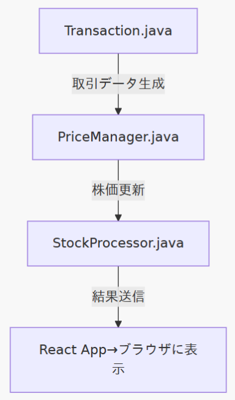
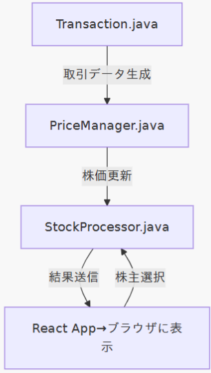
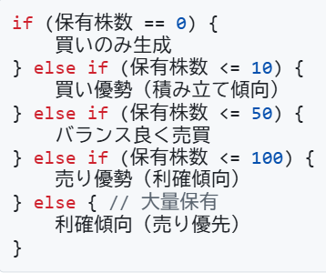
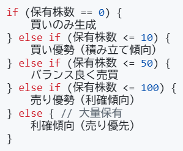
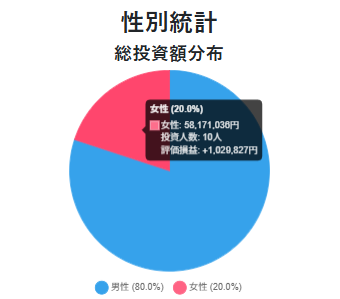
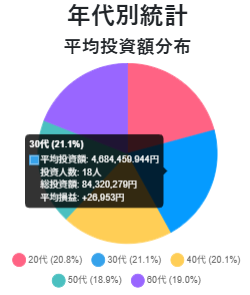
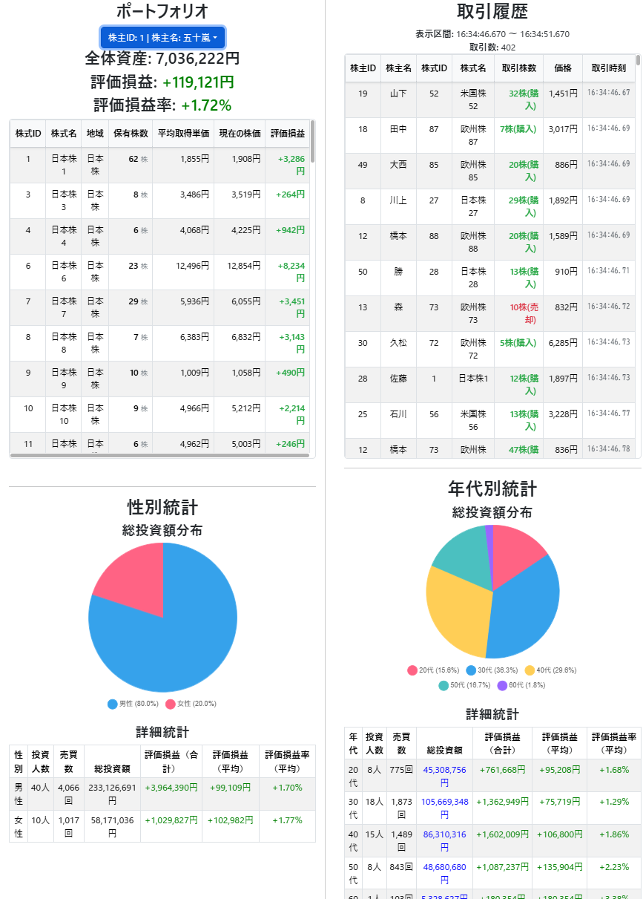
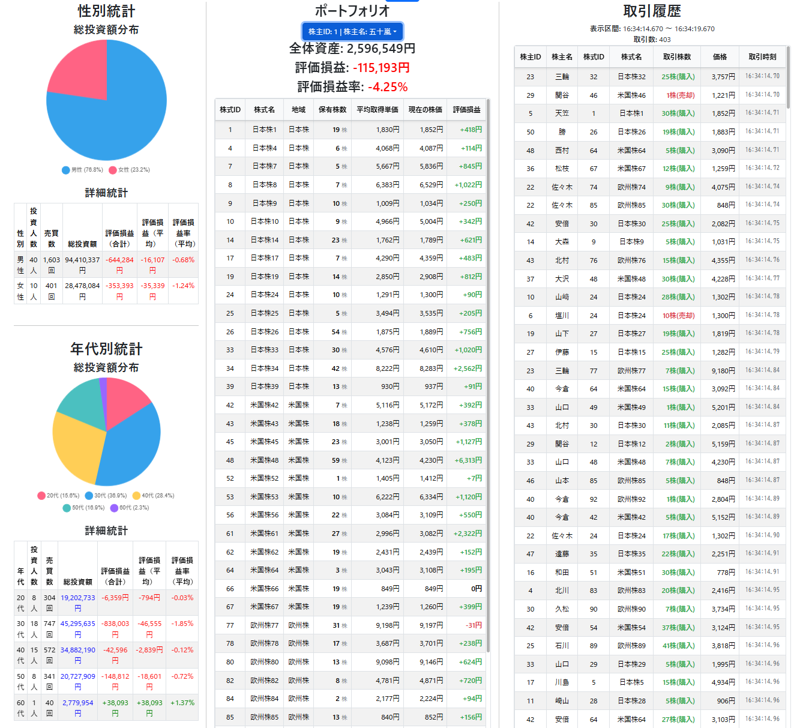

# 課題6 - リアルタイム株式取引分析システム

**リアルタイム株式データ処理・可視化システム**
**発表者**: 情報科学類3年 202310970 五十嵐 尊人
<!-- 
今回は課題6として、リアルタイムで株式取引を分析するWebアプリケーションを実装しました。
このシステムでは、株取引をリアルタイムで生成し、株価変動とポートフォリオ分析等を行います。
-->

---

# 実装のきっかけ 🎯

- **個人的な興味**: 元々株取引に関心があった。
- **学んだ内容の活用**: 課題1~5で学んだ技術を活かしたい。
- **実装の拡張性**: 自分で細かい実装を工夫できると感じた。

<!-- 
標準課題の中からリアルタイム株式分析を選択した理由は、個人的に株取引に興味があったことと、
ここまでの課題1~5で学んだ内容を活かしながらも、自分で細かい実装を工夫することができそうだと感じたため、選びました。
-->

---

<!-- <div class="flex fw">
<div style="--fw: 5;">  -->

# システム概要 📊


## 主な機能

- **Transactionサービス**による株取引データの自動生成
- **動的株価変動**（取引量に応じた価格調整）
- **スライディングウィンドウ**機能を含む取引履歴の管理
- **リアルタイムポートフォリオ**分析
- **統計情報の可視化**（性別・年代別総投資額のグラフ等）
  
<!-- </div>
<div style="--fw: 1;"> -->

<!--  -->


<!-- </div>
</div> -->


<!-- 
このシステムでは、Transaction.javaでリアルタイムの株取引データの生成を行い、その取引に応じて株価がリアルタイムで変動します。
各投資家のポートフォリオは一定時間ごとに更新され、Webブラウザで性別・年代別の統計情報と併せて可視化されます。
-->

---

# 標準課題からの主な変更点 🔄

## アーキテクチャの改善

**旧構成**: 独立した株価・取引生成

```

StockPrice.java ↘
                  StockProcessor.java
Transaction.java ↗

```

**新構成**: 統合されたデータフロー

```

Transaction.java ➡️ PriceManager.java ➡️ StockProcessor.java

```

<!-- 
標準課題では株価生成と取引生成が独立していましたが、
より現実的なシステムにするため、取引データを基に株価を変動させる統合アーキテクチャに変更しました。
これにより、取引と株価の整合性が保たれ、より現実的な市場動向を再現できると考えました。
-->

---

# システム技術スタック 🛠

## バックエンド

- **Java 17+**: メインサーバー
- **WebSocket**: リアルタイム通信

## フロントエンド

- **Vite + React + TypeScript**: UI フレームワーク
- [**Chart.js**](https://react-chartjs-2.js.org/): グラフ可視化
- [**TailwindCSS**](https://tailwindcss.com/): レスポンシブ対応
- [**React Bootstrap**](https://react-bootstrap.netlify.app/): UIコンポーネント

<!-- 
技術スタックとしては、バックエンドはJava、フロントエンドはReact + TypeScriptを用いて制作しました。
フロントエンドとのリアルタイム通信にはWebSocketを使用し、グラフ描画にはChart.jsを活用しています。
また、ReactBootstrapとTailwindCSSを部分的に使用しました。
-->

<!-- ---

# メイン処理フロー 🔄

（ここに図を挿入、図は以下のフローを視覚的に表す）

```

1. Transaction.java (取引生成)
   ↓ Socket通信
2. PriceManager.java (価格計算・更新)
   ↓ 統合データ送信
3. StockProcessor.java (分析・集計)
   ↓ WebSocket
4. React Frontend (リアルタイム表示)

``` -->

<!-- 
システムの処理フローを説明します。
まず、Transaction.javaで5000名の投資家による取引データを生成し、
PriceManager.javaがそれを受け取って株価を計算・更新します。
その後、統合されたデータがStockProcessor.javaで分析・集計され、
最終的にWebSocketを通じてReactフロントエンドにリアルタイム送信されます。
-->

---
# 成果物(①~④+α)
①~④を実装。そのうえで①の実装を拡張し、取引に応じた株価変動を実装。


---


# データ整合性の保証 🔒

## 問題

- 取引処理時の**株価参照タイミング**の未保証
- **並行アクセス**による不整合の可能性
- **空売り防止**システム

## 解決策

- **PriceManager**による一元管理
- **取引時点の価格保証**
- **保有株数ベース**の売買制限


<!-- 
実装で最も重要だったのがデータ整合性の保証です。
取引処理時に参照する株価が古くなったり、並行アクセスで不整合が起きる問題を、
PriceManagerによる一元管理で解決しました。
また、保有株数を超える売却を防ぐ空売り防止システムも実装しています。
-->


---

# 工夫した点①: 取引に応じた価格変動 💰

- PriceManagerで**取引量に応じた株価変動**を実装・管理

<div class="flex fw">
<div style="--fw: 2;"> <!-- 左右の比率を設定 -->

```java
// 取引量に応じた価格変動ロジック
if (取引量 > 0 ) { // 買い注文
    基本変動率 = +0.01; // 1%価格上昇
} else { // 売り注文
    基本変動率 = -0.01; // 1%価格下落
}

取引量倍率 = // 1~2倍 取引量が多いほど大きい;
ランダム係数 = // 0.5~1.5倍;

変動率 = 基本変動率 * 取引量倍率 * ランダム係数;

更新後価格 = 現在価格 * (1 + 変動率);
```

</div>
<div style="--fw: 2;">

取引データが

- 買い注文なら、取引量に応じて価格を上昇
- 売り注文なら、取引量に応じて価格を下落
- 価格変動はランダム係数を掛けて調整

これにより、取引量が多いほど価格変動が大きくなるように設計

</div>
</div>

---

# 工夫した点②: 現実的な取引生成(未完成) 💡

<div class="flex fw">
<div style="--fw: 3;">

## スマートな売買量決定

<!-- <div style="text-align:center;">
    
</div> -->

<!-- ```java
if (保有株数 == 0) {
    買いのみ生成
} else if (保有株数 <= 10) {
    買い優勢（積み立て傾向）
} else if (保有株数 <= 50) {
    バランス良く売買
} else if (保有株数 <= 100) {
    売り優勢（利確傾向）
} else { // 大量保有
    利確傾向（売り優先）
}
``` -->

Transactionでの保有株数の管理がStockProcessorと独立しているため、
ロジック的に不十分。

</div>

<div style="--fw: 3;">

## 将来的拡張性

### 株主ごとに、投資傾向を設定する

- **長期保有傾向の株主**
  - （買い優勢、同じ株を定期購入傾向）
- **短期トレード傾向の株主**
  - （売買回数多め、利確傾向）

</div>
</div>
<!-- 
現実的な取引を再現するため、投資家の保有状況に応じた売買ロジックを実装しました。
保有していない銘柄は買いのみ、少量保有では買いと売りをバランスよく、
大量保有では利確傾向で売りを優先するなど、実際の投資行動に近づけています。
-->

---

# その他実装点①: データ可視化 📈

## Chart.js による動的グラフ

- **円グラフ（性別）**: 市場資金の性別分布
  - **市場への影響力**、**投資格差の実態**を可視化
- **円グラフ（年代別）**: 世代別の平均投資額
  - **ライフステージ別の投資余力**、**世代間格差**を可視化
  - 右図では、取引の売買量を年齢によって変更するところまで実装できなかったので、
    割合はほぼ同じ



<!-- 
データの可視化にも力を入れました。Chart.jsを使用して、
地域別の資産配分を円グラフ、性別・年代別の統計を棒グラフで表示しています。
すべてのグラフがリアルタイムで更新され、滑らかなアニメーションで
データの変化を直感的に理解できるようになっています。
-->

---

# その他実装点②: レスポンシブUI実装 📱

<div class="flex fw">

<div style="--fw: 3;">

## タブレット・スマホ - 2列表示

<!-- ```
[ポートフォリオ + 統計] | [取引履歴 + 統計]
``` -->


</div>

<div style="--fw: 3;">

## PC (1200px以上) - 3列表示

<!-- ```
[統計情報] | [ポートフォリオ] | [取引履歴]
``` -->



</div>

<!-- 
ユーザビリティ向上のため、レスポンシブデザインを実装しました。
PC画面では統計情報、ポートフォリオ、取引履歴を3列で同時表示し、
タブレットやスマートフォンでは2列表示に最適化しています。
TailwindCSSのブレークポイント機能を活用して実装しています。
-->
</div>
<!-- --- -->


---

# 苦労した点 1: データ同期問題 😓

## 問題の詳細

- **Transaction.java**: 起動時から保有株数を蓄積
- **StockProcessor**: 途中接続でデータ不整合
- **結果**: マイナス保有株数の発生

## 応急対応(フロントエンド側)

```typescript
{portfolioSummary.stocks
  .filter(stock => stock.quantity > 0) // マイナス除外
  .map(stock => (/* 表示処理 */))
}
```

<!-- 
最も苦労したのがデータ同期の問題です。
Transaction.javaは起動時から保有株数を管理していますが、
StockProcessorが途中から接続するため、データの不整合が発生し、
マイナスの保有株数が生まれてしまいました。
時間的制約のため、フロントエンド側でマイナス株を除外する応急対応を行いました。
-->

---

# 苦労した点 2: マイクロサービス間通信 🌐

<div class="flex fw">

<div>

## 複雑な通信フロー

```
Transaction ↔ PriceManager ↔ StockProcessor
```

`Transaction`に対して「`StockProcessor`の接続状態」を`PriceManager`を通じて伝える2箇所の双向通信が必要で、この実装が間に合わなかった。

</div>

<div>

## 課題

- **双方向通信**の設計複雑性
- **接続状態の伝播**
- **エラーハンドリング**

</div>
</div>

<!-- 
3つのサービス間での複雑な通信設計も大きな課題でした。
特に、StockProcessorの接続状況をTransactionに伝える双方向通信の実装は、
時間的制約もあり完全には実装できませんでした。
各サービスの独立性を保ちながら、適切な情報共有を行う設計の難しさを実感しました。
-->

---

# 実装できなかった点 🚧

## 主な未実装機能

### 1. **完全な空売り防止**

- 現在: フロントエンド側フィルタリング
- 理想: バックエンドでの根本的解決

### 2. **データ永続化**

- 現在: メモリ内保持のみ
- 理想: データベース連携

<!-- 
時間的制約により実装できなかった機能もあります。
空売り防止の根本的解決、
データベースを使った永続化などが主な未実装項目です。
これらは今後の改善課題として残っています。
-->

---

# 今後の改善案・展望 🚀

## 短期的改善

- **データ同期の根本解決**
- **投資家の行動傾向設定**（年齢別の売買行動傾向やランダムな行動パターンを設定）

## 長期的展望

- **信用取引システム** (空売り機能を実装)
- **株式配当システム**（時間の進みを早め配当支払日に保有株数に応じた配当を分配）
- **リアルタイム通知機能**（大きな株価変動や配当支払いを通知）

<!-- ### 投資家の行動傾向設定 🧠

- **年齢別傾向**: 投資家の年齢に応じた売買行動を設定
    - 若年層: リスクを取る傾向が強く、短期トレードを好む
    - 中年層: 安定した投資を好み、長期保有傾向が強い
    - 高齢層: 利益確定を優先し、売却が多い傾向

- **ランダム傾向**: 投資家ごとにランダムな行動パターンを生成
    - リスク許容度や投資スタイルをランダムに設定
    - 市場の多様性を再現し、リアルな動向をシミュレーション -->

<!-- 
今後の改善案として、短期的にはデータ同期問題の根本解決と株価制限の撤廃を予定しています。
長期的には、信用取引システムや株式配当、機械学習を使った投資家行動の高度化、
プッシュ通知機能なども検討しています。
より現実的で高機能な株式分析システムへの発展を目指しています。
-->

---

<!-- # デモンストレーション 🎮

## 見どころ

1. **リアルタイム取引**の瞬間更新
2. **株価変動**の連動性
3. **ポートフォリオ**の動的計算
4. **統計グラフ**のスムーズな更新
5. **レスポンシブ**画面切り替え

<!-- （ここに図を挿入、図は実際のWebアプリケーション画面のスクリーンショットを表す） -->

<!-- 
それでは実際のシステムをデモンストレーションします。
リアルタイムで取引が発生し、株価が変動し、ポートフォリオが更新される様子、
そして美しいグラフでの統計表示をご覧ください。
また、画面サイズを変更した際のレスポンシブ動作もお見せします。
-->

# まとめ 📝

<div class="flex fw">
<div style="--fw: 3;"> <!-- 左右の比率を設定 -->

## 達成できたこと

- ✅ **リアルタイム**株式分析システムの構築
- ✅ **マイクロサービス**アーキテクチャの実装
- ✅ **レスポンシブ**Web UIの開発
- ✅ **現実的な取引**ロジックの実現

</div>
<div style="--fw: 2;">

## 学んだこと

- **WebSocket**を使ったリアルタイム通信
- **React**での動的データ可視化
- **分散システム**の設計課題

</div>
</div>

<!-- 
今回の実装を通じて、リアルタイムデータ処理の技術的な側面から、
ユーザビリティを考慮したフロントエンド開発まで、
幅広い技術要素を学ぶことができました。
特に、WebSocketを使ったリアルタイム通信や、
分散システムにおけるデータ整合性の重要性を実感しました。
-->

---

# 発表は、以上です。

**ありがとうございました。**


<!-- 
以上で発表を終わります。
ありがとうございました。
-->
